## Contents
{:.no_toc}
*  
{: toc}


### Description:
Creates functions to get track and artist features from Spotify's API using Spotipy Package. After getting the required track and artist features, it creates a pandas database with the requested variables. Finally, Exploratory Data Analysis is carried out.

Spotipy Package can be found at: https://spotipy.readthedocs.io


<hr style="height:2pt">


```python
import json # import the json library
%matplotlib inline
import numpy as np
import scipy 
import matplotlib as mpl
import matplotlib.cm as cm
import matplotlib.pyplot as plt
import pandas as pd
import time
import re
pd.set_option('display.width', 500)
pd.set_option('display.max_columns', 100)
pd.set_option('display.notebook_repr_html', True)
import seaborn as sns
import spotipy
from spotipy.oauth2 import SpotifyClientCredentials
import spotipy.util as util
from pandas.tools.plotting import table

```


```python
#reading playlist files which are in json format
path = "/Users/danny_barjum/Dropbox/DS Project/01 - Data"
with open(path+"/mpd.slice.0-999.json", "r") as fd:
    plylist = json.load(fd)
    
```


```python
def feature_list_func(plylist_dic, feature, n_playlist):
    feature_list = []
    length_playlist = np.minimum(n_playlist,len(plylist_dic.get('playlists'))) # the output will be based on the min of the n_playlist and the actual length of the input playlist
    for i in range(length_playlist):
        playlist = plylist_dic.get('playlists')[i]
        for j in range(len(playlist.get('tracks'))):
            feature_list.append(playlist.get('tracks')[j].get(feature))
    return feature_list
            
        
```


```python
def common_feature_func(plylist_dic, n, feature,n_playlist): 
    # this function will return the n most repeated feature in the play list, for example the n most common artist or ...
    feature_lists= pd.DataFrame(feature_list_func(plylist_dic,feature,n_playlist), columns=[feature]) #creating a list of all feature (artist) of all tracks of the play list
    common_feature = feature_lists.groupby([feature],as_index=False).size().sort_values(ascending=False)[0:n]
    return common_feature.reset_index(drop=False)                        
                               
```


```python
track_uri = feature_list_func(plylist, feature = 'track_uri', n_playlist = 1000)
artist_uri = feature_list_func(plylist, feature = 'artist_uri', n_playlist = 1000)


```


## Description of Data

Our data consist of two primary databases which both are from the same source, Spotify. The primary source is the Million Playlist Dataset and our secondary source is data taken from Spotify’s Web API, this latter one is used to compliment the primary source of data.

**Base Dataset: Million Playlist Dataset**
Our base data consists of a set of music playlists obtained from Spotify’s “The Million Playlist Dataset”. The size of this dataset is approximately 5.4 GB, and its general format is the following:


For EDA purposes, we focused on 1000 playlists in order to get a quick understanding of the structure of the data. A sample of the raw format of the data is as follows:


From the base dataset, we can extract the following useful track information within any playlist:
1.	Track Name
2.	Artist Name
3.	Album Name
4.	Track URI – Unique Spotify identifier for that particular song
5.	Artist URI – Unique Spotify identifier for that particular artist
6.	Duration_ms – duration of song in milliseconds

This dataset does not contain enough meaningful information about the tracks, but it does contain enough information for us to search additional databases for complementary data. We obtained a unique Spotify song identifier called “track_uri” and a unique Spotify artist identifier called “artist_uri” which we used to obtain additional data from Spotify’s web API.

**Second Dataset: Spotify Web API**
In order to obtain more meaningful and descriptive variables about each of the tracks that we sample, we interfaced with Spotify’s web API where the following information about any song can be obtained:


```python
def create_spotipy_obj():
    
    """
    Uses dbarjum's client id for DS Project
    """

    SPOTIPY_CLIENT_ID = '54006da9bd7849b7906b944a7fa4e29d'
    SPOTIPY_CLIENT_SECRET = 'f54ae294a30c4a99b2ff330a923cd6e3'
    SPOTIPY_REDIRECT_URI = 'http://localhost/'

    username = 'dbarjum'
    scope = 'user-library-read'
    
    token = util.prompt_for_user_token(username,scope,client_id=SPOTIPY_CLIENT_ID,
                           client_secret=SPOTIPY_CLIENT_SECRET,
                           redirect_uri=SPOTIPY_REDIRECT_URI)
    client_credentials_manager = SpotifyClientCredentials(client_id=SPOTIPY_CLIENT_ID, 
                                                          client_secret=SPOTIPY_CLIENT_SECRET, proxies=None)
    sp = spotipy.Spotify(client_credentials_manager=client_credentials_manager)
    
    return sp
```


```python
sp = create_spotipy_obj()
```


```python
def get_all_features(track_list = list, artist_list = list, sp=None):
    
    """
    This function takes in a list of tracks and a list of artists, along
    with a spotipy object and generates two lists of features from Spotify's API.
    
    inputs:
        1. track_list: list of all tracks to be included in dataframe
        2. artist_list: list of all artists corresponding to tracks
        3. sp: spotipy object to communicate with Spotify API
    
    returns:
        1. track_features: list of all features for each track in track_list
        2. artist_features: list of all artist features for each artist in artist_list
    """
    
    track_features = []
    artist_features = []
    
    track_iters = int(len(track_list)/50)
    track_remainders = len(track_list)%50

    start = 0
    end = start+50
    
    for i in range(track_iters):
        track_features.extend(sp.audio_features(track_list[start:end]))
        artist_features.extend(sp.artists(artist_list[start:end]).get('artists'))
        start += 50
        end = start+50
    

    if track_remainders:
        end = start + track_remainders
        track_features.extend(sp.audio_features(track_list[start:end]))
        artist_features.extend(sp.artists(artist_list[start:end]).get('artists'))
    
    
    return track_features, artist_features
```


```python
start_time = time.time()
t_features, a_features = get_all_features(track_uri, artist_uri, sp)
print("--- %s seconds ---" % (time.time() - start_time))
```


    --- 293.70928382873535 seconds ---


```python
def create_song_df(track_features=list, artist_features=list):
    
    """
    This function takes in two lists of track and artist features, respectively,
    and generates a dataframe of the features.
    
    inputs:
        1. track_features: list of all tracks including features
        2. artist_features: list of all artists including features
    
    returns:
        1. df: a pandas dataframe of size (N, X) where N corresponds to the number of songs
        in track_features, X is the number of features in the dataframe.
    """
    
    import pandas as pd
    
    selected_song_features = ['uri', 'duration_ms', 'time_signature', 'key',
                              'tempo', 'energy', 'mode', 'loudness', 'speechiness', 
                              'danceability', 'acousticness', 'instrumentalness', 
                              'valence', 'liveness']
    selected_artist_features = ['followers', 'uri', 'name', 'popularity', 'genres']
    
    col_names = ['song_uri', 'duration_ms', 'time_signature', 'key',
                 'tempo', 'energy', 'mode', 'loudness', 'speechiness', 
                 'danceability', 'acousticness', 'instrumentalness', 
                 'valence', 'liveness', 'artist_followers', 'artist_uri',
                 'artist_name', 'artist_popularity']
    
    
    data = []

    for i, j in zip(track_features, artist_features):
        temp = []
        for sf in selected_song_features:
            temp.append(i.get(sf))
        for af in selected_artist_features:
            if af == 'followers':
                temp.append(j.get('followers').get('total'))
            elif af == 'genres':
                for g in j.get('genres'):
                    temp.append(g)
            else:
                temp.append(j.get(af))

        data.append(list(temp))
    
    df = pd.DataFrame(data)

    for i in range(len(df.columns)- len(col_names)):
        col_names.append('g'+str(i+1))

    df.columns = col_names
    
    return df
```


```python
songs_df = create_song_df(t_features, a_features)

songs_df.head()
```


<div>
<style scoped>
    .dataframe tbody tr th:only-of-type {
        vertical-align: middle;
    }

    .dataframe tbody tr th {
        vertical-align: top;
    }

    .dataframe thead th {
        text-align: right;
    }
</style>
<table border="1" class="dataframe">
  <thead>
    <tr style="text-align: right;">
      <th></th>
      <th>song_uri</th>
      <th>duration_ms</th>
      <th>time_signature</th>
      <th>key</th>
      <th>tempo</th>
      <th>energy</th>
      <th>mode</th>
      <th>loudness</th>
      <th>speechiness</th>
      <th>danceability</th>
      <th>acousticness</th>
      <th>instrumentalness</th>
      <th>valence</th>
      <th>liveness</th>
      <th>artist_followers</th>
      <th>artist_uri</th>
      <th>artist_name</th>
      <th>artist_popularity</th>
      <th>g1</th>
      <th>g2</th>
      <th>g3</th>
      <th>g4</th>
      <th>g5</th>
      <th>g6</th>
      <th>g7</th>
      <th>g8</th>
      <th>g9</th>
      <th>g10</th>
      <th>g11</th>
      <th>g12</th>
      <th>g13</th>
      <th>g14</th>
      <th>g15</th>
      <th>g16</th>
      <th>g17</th>
      <th>g18</th>
      <th>g19</th>
      <th>g20</th>
      <th>g21</th>
      <th>g22</th>
      <th>g23</th>
      <th>g24</th>
      <th>g25</th>
      <th>g26</th>
      <th>g27</th>
      <th>g28</th>
      <th>g29</th>
      <th>g30</th>
    </tr>
  </thead>
  <tbody>
    <tr>
      <th>0</th>
      <td>spotify:track:0UaMYEvWZi0ZqiDOoHU3YI</td>
      <td>226864</td>
      <td>4</td>
      <td>4</td>
      <td>125.461</td>
      <td>0.813</td>
      <td>0</td>
      <td>-7.105</td>
      <td>0.1210</td>
      <td>0.904</td>
      <td>0.03110</td>
      <td>0.006970</td>
      <td>0.810</td>
      <td>0.0471</td>
      <td>900226</td>
      <td>spotify:artist:2wIVse2owClT7go1WT98tk</td>
      <td>Missy Elliott</td>
      <td>76</td>
      <td>dance pop</td>
      <td>hip hop</td>
      <td>hip pop</td>
      <td>pop</td>
      <td>pop rap</td>
      <td>r&amp;b</td>
      <td>rap</td>
      <td>southern hip hop</td>
      <td>urban contemporary</td>
      <td>None</td>
      <td>None</td>
      <td>None</td>
      <td>None</td>
      <td>None</td>
      <td>None</td>
      <td>None</td>
      <td>None</td>
      <td>None</td>
      <td>None</td>
      <td>None</td>
      <td>None</td>
      <td>None</td>
      <td>None</td>
      <td>None</td>
      <td>None</td>
      <td>None</td>
      <td>None</td>
      <td>None</td>
      <td>None</td>
      <td>None</td>
    </tr>
    <tr>
      <th>1</th>
      <td>spotify:track:6I9VzXrHxO9rA9A5euc8Ak</td>
      <td>198800</td>
      <td>4</td>
      <td>5</td>
      <td>143.040</td>
      <td>0.838</td>
      <td>0</td>
      <td>-3.914</td>
      <td>0.1140</td>
      <td>0.774</td>
      <td>0.02490</td>
      <td>0.025000</td>
      <td>0.924</td>
      <td>0.2420</td>
      <td>5407311</td>
      <td>spotify:artist:26dSoYclwsYLMAKD3tpOr4</td>
      <td>Britney Spears</td>
      <td>81</td>
      <td>dance pop</td>
      <td>pop</td>
      <td>post-teen pop</td>
      <td>None</td>
      <td>None</td>
      <td>None</td>
      <td>None</td>
      <td>None</td>
      <td>None</td>
      <td>None</td>
      <td>None</td>
      <td>None</td>
      <td>None</td>
      <td>None</td>
      <td>None</td>
      <td>None</td>
      <td>None</td>
      <td>None</td>
      <td>None</td>
      <td>None</td>
      <td>None</td>
      <td>None</td>
      <td>None</td>
      <td>None</td>
      <td>None</td>
      <td>None</td>
      <td>None</td>
      <td>None</td>
      <td>None</td>
      <td>None</td>
    </tr>
    <tr>
      <th>2</th>
      <td>spotify:track:0WqIKmW4BTrj3eJFmnCKMv</td>
      <td>235933</td>
      <td>4</td>
      <td>2</td>
      <td>99.259</td>
      <td>0.758</td>
      <td>0</td>
      <td>-6.583</td>
      <td>0.2100</td>
      <td>0.664</td>
      <td>0.00238</td>
      <td>0.000000</td>
      <td>0.701</td>
      <td>0.0598</td>
      <td>16514236</td>
      <td>spotify:artist:6vWDO969PvNqNYHIOW5v0m</td>
      <td>Beyoncé</td>
      <td>87</td>
      <td>dance pop</td>
      <td>pop</td>
      <td>post-teen pop</td>
      <td>r&amp;b</td>
      <td>None</td>
      <td>None</td>
      <td>None</td>
      <td>None</td>
      <td>None</td>
      <td>None</td>
      <td>None</td>
      <td>None</td>
      <td>None</td>
      <td>None</td>
      <td>None</td>
      <td>None</td>
      <td>None</td>
      <td>None</td>
      <td>None</td>
      <td>None</td>
      <td>None</td>
      <td>None</td>
      <td>None</td>
      <td>None</td>
      <td>None</td>
      <td>None</td>
      <td>None</td>
      <td>None</td>
      <td>None</td>
      <td>None</td>
    </tr>
    <tr>
      <th>3</th>
      <td>spotify:track:1AWQoqb9bSvzTjaLralEkT</td>
      <td>267267</td>
      <td>4</td>
      <td>4</td>
      <td>100.972</td>
      <td>0.714</td>
      <td>0</td>
      <td>-6.055</td>
      <td>0.1400</td>
      <td>0.891</td>
      <td>0.20200</td>
      <td>0.000234</td>
      <td>0.818</td>
      <td>0.0521</td>
      <td>7281071</td>
      <td>spotify:artist:31TPClRtHm23RisEBtV3X7</td>
      <td>Justin Timberlake</td>
      <td>83</td>
      <td>dance pop</td>
      <td>pop</td>
      <td>None</td>
      <td>None</td>
      <td>None</td>
      <td>None</td>
      <td>None</td>
      <td>None</td>
      <td>None</td>
      <td>None</td>
      <td>None</td>
      <td>None</td>
      <td>None</td>
      <td>None</td>
      <td>None</td>
      <td>None</td>
      <td>None</td>
      <td>None</td>
      <td>None</td>
      <td>None</td>
      <td>None</td>
      <td>None</td>
      <td>None</td>
      <td>None</td>
      <td>None</td>
      <td>None</td>
      <td>None</td>
      <td>None</td>
      <td>None</td>
      <td>None</td>
    </tr>
    <tr>
      <th>4</th>
      <td>spotify:track:1lzr43nnXAijIGYnCT8M8H</td>
      <td>227600</td>
      <td>4</td>
      <td>0</td>
      <td>94.759</td>
      <td>0.606</td>
      <td>1</td>
      <td>-4.596</td>
      <td>0.0713</td>
      <td>0.853</td>
      <td>0.05610</td>
      <td>0.000000</td>
      <td>0.654</td>
      <td>0.3130</td>
      <td>1036043</td>
      <td>spotify:artist:5EvFsr3kj42KNv97ZEnqij</td>
      <td>Shaggy</td>
      <td>74</td>
      <td>dance pop</td>
      <td>pop rap</td>
      <td>reggae fusion</td>
      <td>None</td>
      <td>None</td>
      <td>None</td>
      <td>None</td>
      <td>None</td>
      <td>None</td>
      <td>None</td>
      <td>None</td>
      <td>None</td>
      <td>None</td>
      <td>None</td>
      <td>None</td>
      <td>None</td>
      <td>None</td>
      <td>None</td>
      <td>None</td>
      <td>None</td>
      <td>None</td>
      <td>None</td>
      <td>None</td>
      <td>None</td>
      <td>None</td>
      <td>None</td>
      <td>None</td>
      <td>None</td>
      <td>None</td>
      <td>None</td>
    </tr>
  </tbody>
</table>
</div>


```python
songs_df.shape
```


    (67503, 48)


### Data manipulation and prioritization of variables 
When requesting track data from the API, each song request returns 18 track features. Similarily, when requesting artist data through the API, each request returns 10 features for each artist. Not all of the features returned from the API are useful for our analysis, for example, images from an album are not useful toward predicting a playlist. Therefore, from the 28 possible features that are returned by the Spotify API, we selected 19 to be used for EDA. A few of these 19 variables will not be used for modeling but are needed for tracking purposes. For example, we need to keep track of a song’s unique identifier in order to avoid suggesting that one song be added into a playlist that already contains that one song. Likewise, we may keep track of an artist’s unique identifier in case we want to request songs from a particular artist.

One of the features that we found interesting to explore and understand further is Spotify’s classification of artists into genres. Each artist can be classified as belonging to many genres, for example, an artist can be classified as belonging to a single genre, while another artist can be classified as belonging to 21 genres. Likewise, there are repeated genre classifications under different names, for example, some artists are classified as “k-pop” while others are classified under “Korean pop”; these two are the same.

In order to get around these issues, we decided to classify each song as belonging to only one of five possible macro genres: Rap, Pop, Rock, Pop Rock, and Other.

These categories were chosen upon a qualitative analysis of the genres provided by Spotify API for each song. The classification was done by use of the following logic: 

    •If rap, hiphop, r&b appeared as one of the genres for the song, that song was classified as “Rap”
    •If both the words Rock and Pop appeared as genres for the song (eg: rock, dance rock, pop, dance pop), that song was classified as “Pop Rock”
    •If the word Pop appeared as one of the genres for the song (eg: pop, dance pop), that song was classified as “Pop”
    •If the word Rock appeared as one of the genres for the song (eg: rock, dance rock), that song was classified as “Rock”
    •If none of the keywords defined above showed in the genres of the song, that song was classified as “Other”

After classifying the genres, we created a pandas dataframe of size Nx19 where N is the number of songs obtained and 19 is the number of features for each song in the dataframe. A screenshot of our database is presented below:


```python
def genre_generator(songs_df):

    # Defining genres to single genre
    rap = ["rap","hiphop", "r&d"]

    # finding position of g1 and last position of gX in columns, to use it later for assessingn genre of song

    g1_index = 0 
    last_column_index = 0

    column_names = songs_df.columns.values

    for i in column_names:
        if i == "g1":
            break
        g1_index += 1

    for i in column_names:
        last_column_index += 1

    # loop to create gender for each song in dataframe     

    songs_df["genre"] = "" 

    for j in range(len(songs_df)):

        # Creating list of genres for a given song  
        genres_row = list(songs_df.iloc[[j]][column_names[g1_index:last_column_index-1]].dropna(axis=1).values.flatten())
        # genres_row = ['british invasion', 'merseybeat', 'psychedelic']

        # classifing genre for the song

        genre = "other"

        if any("rock" in s for s in genres_row) and any("pop" in s for s in genres_row):
            genre = "pop rock"
        elif any("rock" in s for s in genres_row):
            genre = "rock"
        elif any("pop" in s for s in genres_row):
            genre = "pop"

        for i in rap:
            if any(i in s for s in genres_row):
                genre = "rap"

        # giving column genre the classified genre for a given song         
        songs_df.set_value(j, 'genre', genre)
    
    return songs_df
```


```python
songs_df_new = genre_generator(songs_df)
```


    /Users/danny_barjum/anaconda3/lib/python3.6/site-packages/ipykernel_launcher.py:47: FutureWarning: set_value is deprecated and will be removed in a future release. Please use .at[] or .iat[] accessors instead


```python
songs_df_new
```


<div>
<style scoped>
    .dataframe tbody tr th:only-of-type {
        vertical-align: middle;
    }

    .dataframe tbody tr th {
        vertical-align: top;
    }

    .dataframe thead th {
        text-align: right;
    }
</style>
<table border="1" class="dataframe">
  <thead>
    <tr style="text-align: right;">
      <th></th>
      <th>song_uri</th>
      <th>duration_ms</th>
      <th>time_signature</th>
      <th>key</th>
      <th>tempo</th>
      <th>energy</th>
      <th>mode</th>
      <th>loudness</th>
      <th>speechiness</th>
      <th>danceability</th>
      <th>acousticness</th>
      <th>instrumentalness</th>
      <th>valence</th>
      <th>liveness</th>
      <th>artist_followers</th>
      <th>artist_uri</th>
      <th>artist_name</th>
      <th>artist_popularity</th>
      <th>g1</th>
      <th>g2</th>
      <th>g3</th>
      <th>g4</th>
      <th>g5</th>
      <th>g6</th>
      <th>g7</th>
      <th>g8</th>
      <th>g9</th>
      <th>g10</th>
      <th>g11</th>
      <th>g12</th>
      <th>g13</th>
      <th>g14</th>
      <th>g15</th>
      <th>g16</th>
      <th>g17</th>
      <th>g18</th>
      <th>g19</th>
      <th>g20</th>
      <th>g21</th>
      <th>g22</th>
      <th>g23</th>
      <th>g24</th>
      <th>g25</th>
      <th>g26</th>
      <th>g27</th>
      <th>g28</th>
      <th>g29</th>
      <th>g30</th>
      <th>genre</th>
    </tr>
  </thead>
  <tbody>
    <tr>
      <th>0</th>
      <td>spotify:track:0UaMYEvWZi0ZqiDOoHU3YI</td>
      <td>226864</td>
      <td>4</td>
      <td>4</td>
      <td>125.461</td>
      <td>0.8130</td>
      <td>0</td>
      <td>-7.105</td>
      <td>0.1210</td>
      <td>0.904</td>
      <td>0.031100</td>
      <td>0.006970</td>
      <td>0.8100</td>
      <td>0.0471</td>
      <td>900226</td>
      <td>spotify:artist:2wIVse2owClT7go1WT98tk</td>
      <td>Missy Elliott</td>
      <td>76</td>
      <td>dance pop</td>
      <td>hip hop</td>
      <td>hip pop</td>
      <td>pop</td>
      <td>pop rap</td>
      <td>r&amp;b</td>
      <td>rap</td>
      <td>southern hip hop</td>
      <td>urban contemporary</td>
      <td>None</td>
      <td>None</td>
      <td>None</td>
      <td>None</td>
      <td>None</td>
      <td>None</td>
      <td>None</td>
      <td>None</td>
      <td>None</td>
      <td>None</td>
      <td>None</td>
      <td>None</td>
      <td>None</td>
      <td>None</td>
      <td>None</td>
      <td>None</td>
      <td>None</td>
      <td>None</td>
      <td>None</td>
      <td>None</td>
      <td>None</td>
      <td>rap</td>
    </tr>
    <tr>
      <th>1</th>
      <td>spotify:track:6I9VzXrHxO9rA9A5euc8Ak</td>
      <td>198800</td>
      <td>4</td>
      <td>5</td>
      <td>143.040</td>
      <td>0.8380</td>
      <td>0</td>
      <td>-3.914</td>
      <td>0.1140</td>
      <td>0.774</td>
      <td>0.024900</td>
      <td>0.025000</td>
      <td>0.9240</td>
      <td>0.2420</td>
      <td>5407311</td>
      <td>spotify:artist:26dSoYclwsYLMAKD3tpOr4</td>
      <td>Britney Spears</td>
      <td>81</td>
      <td>dance pop</td>
      <td>pop</td>
      <td>post-teen pop</td>
      <td>None</td>
      <td>None</td>
      <td>None</td>
      <td>None</td>
      <td>None</td>
      <td>None</td>
      <td>None</td>
      <td>None</td>
      <td>None</td>
      <td>None</td>
      <td>None</td>
      <td>None</td>
      <td>None</td>
      <td>None</td>
      <td>None</td>
      <td>None</td>
      <td>None</td>
      <td>None</td>
      <td>None</td>
      <td>None</td>
      <td>None</td>
      <td>None</td>
      <td>None</td>
      <td>None</td>
      <td>None</td>
      <td>None</td>
      <td>None</td>
      <td>pop</td>
    </tr>
    <tr>
      <th>2</th>
      <td>spotify:track:0WqIKmW4BTrj3eJFmnCKMv</td>
      <td>235933</td>
      <td>4</td>
      <td>2</td>
      <td>99.259</td>
      <td>0.7580</td>
      <td>0</td>
      <td>-6.583</td>
      <td>0.2100</td>
      <td>0.664</td>
      <td>0.002380</td>
      <td>0.000000</td>
      <td>0.7010</td>
      <td>0.0598</td>
      <td>16514236</td>
      <td>spotify:artist:6vWDO969PvNqNYHIOW5v0m</td>
      <td>Beyoncé</td>
      <td>87</td>
      <td>dance pop</td>
      <td>pop</td>
      <td>post-teen pop</td>
      <td>r&amp;b</td>
      <td>None</td>
      <td>None</td>
      <td>None</td>
      <td>None</td>
      <td>None</td>
      <td>None</td>
      <td>None</td>
      <td>None</td>
      <td>None</td>
      <td>None</td>
      <td>None</td>
      <td>None</td>
      <td>None</td>
      <td>None</td>
      <td>None</td>
      <td>None</td>
      <td>None</td>
      <td>None</td>
      <td>None</td>
      <td>None</td>
      <td>None</td>
      <td>None</td>
      <td>None</td>
      <td>None</td>
      <td>None</td>
      <td>None</td>
      <td>pop</td>
    </tr>
    <tr>
      <th>3</th>
      <td>spotify:track:1AWQoqb9bSvzTjaLralEkT</td>
      <td>267267</td>
      <td>4</td>
      <td>4</td>
      <td>100.972</td>
      <td>0.7140</td>
      <td>0</td>
      <td>-6.055</td>
      <td>0.1400</td>
      <td>0.891</td>
      <td>0.202000</td>
      <td>0.000234</td>
      <td>0.8180</td>
      <td>0.0521</td>
      <td>7281071</td>
      <td>spotify:artist:31TPClRtHm23RisEBtV3X7</td>
      <td>Justin Timberlake</td>
      <td>83</td>
      <td>dance pop</td>
      <td>pop</td>
      <td>None</td>
      <td>None</td>
      <td>None</td>
      <td>None</td>
      <td>None</td>
      <td>None</td>
      <td>None</td>
      <td>None</td>
      <td>None</td>
      <td>None</td>
      <td>None</td>
      <td>None</td>
      <td>None</td>
      <td>None</td>
      <td>None</td>
      <td>None</td>
      <td>None</td>
      <td>None</td>
      <td>None</td>
      <td>None</td>
      <td>None</td>
      <td>None</td>
      <td>None</td>
      <td>None</td>
      <td>None</td>
      <td>None</td>
      <td>None</td>
      <td>None</td>
      <td>pop</td>
    </tr>
    <tr>
      <th>4</th>
      <td>spotify:track:1lzr43nnXAijIGYnCT8M8H</td>
      <td>227600</td>
      <td>4</td>
      <td>0</td>
      <td>94.759</td>
      <td>0.6060</td>
      <td>1</td>
      <td>-4.596</td>
      <td>0.0713</td>
      <td>0.853</td>
      <td>0.056100</td>
      <td>0.000000</td>
      <td>0.6540</td>
      <td>0.3130</td>
      <td>1036043</td>
      <td>spotify:artist:5EvFsr3kj42KNv97ZEnqij</td>
      <td>Shaggy</td>
      <td>74</td>
      <td>dance pop</td>
      <td>pop rap</td>
      <td>reggae fusion</td>
      <td>None</td>
      <td>None</td>
      <td>None</td>
      <td>None</td>
      <td>None</td>
      <td>None</td>
      <td>None</td>
      <td>None</td>
      <td>None</td>
      <td>None</td>
      <td>None</td>
      <td>None</td>
      <td>None</td>
      <td>None</td>
      <td>None</td>
      <td>None</td>
      <td>None</td>
      <td>None</td>
      <td>None</td>
      <td>None</td>
      <td>None</td>
      <td>None</td>
      <td>None</td>
      <td>None</td>
      <td>None</td>
      <td>None</td>
      <td>None</td>
      <td>rap</td>
    </tr>
    <tr>
      <th>5</th>
      <td>spotify:track:0XUfyU2QviPAs6bxSpXYG4</td>
      <td>250373</td>
      <td>4</td>
      <td>2</td>
      <td>104.997</td>
      <td>0.7880</td>
      <td>1</td>
      <td>-4.669</td>
      <td>0.1680</td>
      <td>0.881</td>
      <td>0.021200</td>
      <td>0.000000</td>
      <td>0.5920</td>
      <td>0.0377</td>
      <td>6611063</td>
      <td>spotify:artist:23zg3TcAtWQy7J6upgbUnj</td>
      <td>Usher</td>
      <td>82</td>
      <td>dance pop</td>
      <td>pop</td>
      <td>pop rap</td>
      <td>r&amp;b</td>
      <td>urban contemporary</td>
      <td>None</td>
      <td>None</td>
      <td>None</td>
      <td>None</td>
      <td>None</td>
      <td>None</td>
      <td>None</td>
      <td>None</td>
      <td>None</td>
      <td>None</td>
      <td>None</td>
      <td>None</td>
      <td>None</td>
      <td>None</td>
      <td>None</td>
      <td>None</td>
      <td>None</td>
      <td>None</td>
      <td>None</td>
      <td>None</td>
      <td>None</td>
      <td>None</td>
      <td>None</td>
      <td>None</td>
      <td>None</td>
      <td>rap</td>
    </tr>
    <tr>
      <th>6</th>
      <td>spotify:track:68vgtRHr7iZHpzGpon6Jlo</td>
      <td>223440</td>
      <td>4</td>
      <td>5</td>
      <td>86.412</td>
      <td>0.5070</td>
      <td>1</td>
      <td>-8.238</td>
      <td>0.1180</td>
      <td>0.662</td>
      <td>0.257000</td>
      <td>0.000000</td>
      <td>0.6760</td>
      <td>0.0465</td>
      <td>6611063</td>
      <td>spotify:artist:23zg3TcAtWQy7J6upgbUnj</td>
      <td>Usher</td>
      <td>82</td>
      <td>dance pop</td>
      <td>pop</td>
      <td>pop rap</td>
      <td>r&amp;b</td>
      <td>urban contemporary</td>
      <td>None</td>
      <td>None</td>
      <td>None</td>
      <td>None</td>
      <td>None</td>
      <td>None</td>
      <td>None</td>
      <td>None</td>
      <td>None</td>
      <td>None</td>
      <td>None</td>
      <td>None</td>
      <td>None</td>
      <td>None</td>
      <td>None</td>
      <td>None</td>
      <td>None</td>
      <td>None</td>
      <td>None</td>
      <td>None</td>
      <td>None</td>
      <td>None</td>
      <td>None</td>
      <td>None</td>
      <td>None</td>
      <td>rap</td>
    </tr>
    <tr>
      <th>7</th>
      <td>spotify:track:3BxWKCI06eQ5Od8TY2JBeA</td>
      <td>225560</td>
      <td>4</td>
      <td>2</td>
      <td>210.750</td>
      <td>0.8230</td>
      <td>1</td>
      <td>-4.318</td>
      <td>0.3200</td>
      <td>0.544</td>
      <td>0.158000</td>
      <td>0.000000</td>
      <td>0.4340</td>
      <td>0.2680</td>
      <td>2342307</td>
      <td>spotify:artist:6wPhSqRtPu1UhRCDX5yaDJ</td>
      <td>The Pussycat Dolls</td>
      <td>71</td>
      <td>australian pop</td>
      <td>dance pop</td>
      <td>girl group</td>
      <td>hip pop</td>
      <td>pop</td>
      <td>pop rap</td>
      <td>post-teen pop</td>
      <td>r&amp;b</td>
      <td>urban contemporary</td>
      <td>None</td>
      <td>None</td>
      <td>None</td>
      <td>None</td>
      <td>None</td>
      <td>None</td>
      <td>None</td>
      <td>None</td>
      <td>None</td>
      <td>None</td>
      <td>None</td>
      <td>None</td>
      <td>None</td>
      <td>None</td>
      <td>None</td>
      <td>None</td>
      <td>None</td>
      <td>None</td>
      <td>None</td>
      <td>None</td>
      <td>None</td>
      <td>rap</td>
    </tr>
    <tr>
      <th>8</th>
      <td>spotify:track:7H6ev70Weq6DdpZyyTmUXk</td>
      <td>271333</td>
      <td>4</td>
      <td>5</td>
      <td>138.009</td>
      <td>0.6780</td>
      <td>0</td>
      <td>-3.525</td>
      <td>0.1020</td>
      <td>0.713</td>
      <td>0.273000</td>
      <td>0.000000</td>
      <td>0.7340</td>
      <td>0.1490</td>
      <td>2749480</td>
      <td>spotify:artist:1Y8cdNmUJH7yBTd9yOvr5i</td>
      <td>Destiny's Child</td>
      <td>76</td>
      <td>dance pop</td>
      <td>girl group</td>
      <td>hip pop</td>
      <td>pop</td>
      <td>pop rap</td>
      <td>r&amp;b</td>
      <td>urban contemporary</td>
      <td>None</td>
      <td>None</td>
      <td>None</td>
      <td>None</td>
      <td>None</td>
      <td>None</td>
      <td>None</td>
      <td>None</td>
      <td>None</td>
      <td>None</td>
      <td>None</td>
      <td>None</td>
      <td>None</td>
      <td>None</td>
      <td>None</td>
      <td>None</td>
      <td>None</td>
      <td>None</td>
      <td>None</td>
      <td>None</td>
      <td>None</td>
      <td>None</td>
      <td>None</td>
      <td>rap</td>
    </tr>
    <tr>
      <th>9</th>
      <td>spotify:track:2PpruBYCo4H7WOBJ7Q2EwM</td>
      <td>235213</td>
      <td>4</td>
      <td>4</td>
      <td>79.526</td>
      <td>0.9740</td>
      <td>0</td>
      <td>-2.261</td>
      <td>0.0665</td>
      <td>0.728</td>
      <td>0.103000</td>
      <td>0.000532</td>
      <td>0.9650</td>
      <td>0.1750</td>
      <td>999266</td>
      <td>spotify:artist:1G9G7WwrXka3Z1r7aIDjI7</td>
      <td>OutKast</td>
      <td>76</td>
      <td>dirty south rap</td>
      <td>hip hop</td>
      <td>pop rap</td>
      <td>rap</td>
      <td>southern hip hop</td>
      <td>None</td>
      <td>None</td>
      <td>None</td>
      <td>None</td>
      <td>None</td>
      <td>None</td>
      <td>None</td>
      <td>None</td>
      <td>None</td>
      <td>None</td>
      <td>None</td>
      <td>None</td>
      <td>None</td>
      <td>None</td>
      <td>None</td>
      <td>None</td>
      <td>None</td>
      <td>None</td>
      <td>None</td>
      <td>None</td>
      <td>None</td>
      <td>None</td>
      <td>None</td>
      <td>None</td>
      <td>None</td>
      <td>rap</td>
    </tr>
    <tr>
      <th>10</th>
      <td>spotify:track:2gam98EZKrF9XuOkU13ApN</td>
      <td>242293</td>
      <td>4</td>
      <td>10</td>
      <td>114.328</td>
      <td>0.9700</td>
      <td>0</td>
      <td>-6.098</td>
      <td>0.0506</td>
      <td>0.808</td>
      <td>0.056900</td>
      <td>0.000061</td>
      <td>0.8680</td>
      <td>0.1540</td>
      <td>1281599</td>
      <td>spotify:artist:2jw70GZXlAI8QzWeY2bgRc</td>
      <td>Nelly Furtado</td>
      <td>74</td>
      <td>canadian pop</td>
      <td>dance pop</td>
      <td>pop</td>
      <td>pop rock</td>
      <td>None</td>
      <td>None</td>
      <td>None</td>
      <td>None</td>
      <td>None</td>
      <td>None</td>
      <td>None</td>
      <td>None</td>
      <td>None</td>
      <td>None</td>
      <td>None</td>
      <td>None</td>
      <td>None</td>
      <td>None</td>
      <td>None</td>
      <td>None</td>
      <td>None</td>
      <td>None</td>
      <td>None</td>
      <td>None</td>
      <td>None</td>
      <td>None</td>
      <td>None</td>
      <td>None</td>
      <td>None</td>
      <td>None</td>
      <td>pop rock</td>
    </tr>
    <tr>
      <th>11</th>
      <td>spotify:track:4Y45aqo9QMa57rDsAJv40A</td>
      <td>211693</td>
      <td>4</td>
      <td>4</td>
      <td>99.005</td>
      <td>0.5530</td>
      <td>0</td>
      <td>-4.722</td>
      <td>0.0292</td>
      <td>0.710</td>
      <td>0.002060</td>
      <td>0.000055</td>
      <td>0.7310</td>
      <td>0.0469</td>
      <td>516930</td>
      <td>spotify:artist:2Hjj68yyUPiC0HKEOigcEp</td>
      <td>Jesse McCartney</td>
      <td>66</td>
      <td>dance pop</td>
      <td>neo mellow</td>
      <td>pop</td>
      <td>pop rock</td>
      <td>post-teen pop</td>
      <td>r&amp;b</td>
      <td>urban contemporary</td>
      <td>viral pop</td>
      <td>None</td>
      <td>None</td>
      <td>None</td>
      <td>None</td>
      <td>None</td>
      <td>None</td>
      <td>None</td>
      <td>None</td>
      <td>None</td>
      <td>None</td>
      <td>None</td>
      <td>None</td>
      <td>None</td>
      <td>None</td>
      <td>None</td>
      <td>None</td>
      <td>None</td>
      <td>None</td>
      <td>None</td>
      <td>None</td>
      <td>None</td>
      <td>None</td>
      <td>pop rock</td>
    </tr>
    <tr>
      <th>12</th>
      <td>spotify:track:1HwpWwa6bnqqRhK8agG4RS</td>
      <td>214227</td>
      <td>4</td>
      <td>9</td>
      <td>89.975</td>
      <td>0.6660</td>
      <td>1</td>
      <td>-4.342</td>
      <td>0.0472</td>
      <td>0.660</td>
      <td>0.075900</td>
      <td>0.000000</td>
      <td>0.9330</td>
      <td>0.0268</td>
      <td>516930</td>
      <td>spotify:artist:2Hjj68yyUPiC0HKEOigcEp</td>
      <td>Jesse McCartney</td>
      <td>66</td>
      <td>dance pop</td>
      <td>neo mellow</td>
      <td>pop</td>
      <td>pop rock</td>
      <td>post-teen pop</td>
      <td>r&amp;b</td>
      <td>urban contemporary</td>
      <td>viral pop</td>
      <td>None</td>
      <td>None</td>
      <td>None</td>
      <td>None</td>
      <td>None</td>
      <td>None</td>
      <td>None</td>
      <td>None</td>
      <td>None</td>
      <td>None</td>
      <td>None</td>
      <td>None</td>
      <td>None</td>
      <td>None</td>
      <td>None</td>
      <td>None</td>
      <td>None</td>
      <td>None</td>
      <td>None</td>
      <td>None</td>
      <td>None</td>
      <td>None</td>
      <td>pop rock</td>
    </tr>
    <tr>
      <th>13</th>
      <td>spotify:track:20ORwCJusz4KS2PbTPVNKo</td>
      <td>216880</td>
      <td>4</td>
      <td>9</td>
      <td>79.237</td>
      <td>0.7090</td>
      <td>1</td>
      <td>-5.787</td>
      <td>0.0608</td>
      <td>0.693</td>
      <td>0.035200</td>
      <td>0.000003</td>
      <td>0.8890</td>
      <td>0.0688</td>
      <td>516930</td>
      <td>spotify:artist:2Hjj68yyUPiC0HKEOigcEp</td>
      <td>Jesse McCartney</td>
      <td>66</td>
      <td>dance pop</td>
      <td>neo mellow</td>
      <td>pop</td>
      <td>pop rock</td>
      <td>post-teen pop</td>
      <td>r&amp;b</td>
      <td>urban contemporary</td>
      <td>viral pop</td>
      <td>None</td>
      <td>None</td>
      <td>None</td>
      <td>None</td>
      <td>None</td>
      <td>None</td>
      <td>None</td>
      <td>None</td>
      <td>None</td>
      <td>None</td>
      <td>None</td>
      <td>None</td>
      <td>None</td>
      <td>None</td>
      <td>None</td>
      <td>None</td>
      <td>None</td>
      <td>None</td>
      <td>None</td>
      <td>None</td>
      <td>None</td>
      <td>None</td>
      <td>pop rock</td>
    </tr>
    <tr>
      <th>14</th>
      <td>spotify:track:7k6IzwMGpxnRghE7YosnXT</td>
      <td>192213</td>
      <td>4</td>
      <td>8</td>
      <td>99.990</td>
      <td>0.4540</td>
      <td>0</td>
      <td>-4.802</td>
      <td>0.0294</td>
      <td>0.803</td>
      <td>0.352000</td>
      <td>0.000000</td>
      <td>0.7390</td>
      <td>0.0655</td>
      <td>607006</td>
      <td>spotify:artist:27FGXRNruFoOdf1vP8dqcH</td>
      <td>Cassie</td>
      <td>61</td>
      <td>dance pop</td>
      <td>hip pop</td>
      <td>post-teen pop</td>
      <td>r&amp;b</td>
      <td>urban contemporary</td>
      <td>None</td>
      <td>None</td>
      <td>None</td>
      <td>None</td>
      <td>None</td>
      <td>None</td>
      <td>None</td>
      <td>None</td>
      <td>None</td>
      <td>None</td>
      <td>None</td>
      <td>None</td>
      <td>None</td>
      <td>None</td>
      <td>None</td>
      <td>None</td>
      <td>None</td>
      <td>None</td>
      <td>None</td>
      <td>None</td>
      <td>None</td>
      <td>None</td>
      <td>None</td>
      <td>None</td>
      <td>None</td>
      <td>pop</td>
    </tr>
    <tr>
      <th>15</th>
      <td>spotify:track:1Bv0Yl01xBDZD4OQP93fyl</td>
      <td>256427</td>
      <td>4</td>
      <td>8</td>
      <td>131.105</td>
      <td>0.7310</td>
      <td>1</td>
      <td>-5.446</td>
      <td>0.1340</td>
      <td>0.775</td>
      <td>0.189000</td>
      <td>0.000000</td>
      <td>0.8210</td>
      <td>0.1290</td>
      <td>1222500</td>
      <td>spotify:artist:0f5nVCcR06GX8Qikz0COtT</td>
      <td>Omarion</td>
      <td>67</td>
      <td>dance pop</td>
      <td>deep pop r&amp;b</td>
      <td>hip pop</td>
      <td>pop</td>
      <td>pop rap</td>
      <td>r&amp;b</td>
      <td>rap</td>
      <td>southern hip hop</td>
      <td>urban contemporary</td>
      <td>None</td>
      <td>None</td>
      <td>None</td>
      <td>None</td>
      <td>None</td>
      <td>None</td>
      <td>None</td>
      <td>None</td>
      <td>None</td>
      <td>None</td>
      <td>None</td>
      <td>None</td>
      <td>None</td>
      <td>None</td>
      <td>None</td>
      <td>None</td>
      <td>None</td>
      <td>None</td>
      <td>None</td>
      <td>None</td>
      <td>None</td>
      <td>rap</td>
    </tr>
    <tr>
      <th>16</th>
      <td>spotify:track:4omisSlTk6Dsq2iQD7MA07</td>
      <td>204000</td>
      <td>4</td>
      <td>0</td>
      <td>149.937</td>
      <td>0.9000</td>
      <td>1</td>
      <td>-4.417</td>
      <td>0.0482</td>
      <td>0.487</td>
      <td>0.000068</td>
      <td>0.000000</td>
      <td>0.4840</td>
      <td>0.3580</td>
      <td>3477240</td>
      <td>spotify:artist:0p4nmQO2msCgU4IF37Wi3j</td>
      <td>Avril Lavigne</td>
      <td>80</td>
      <td>canadian pop</td>
      <td>candy pop</td>
      <td>dance pop</td>
      <td>pop</td>
      <td>post-teen pop</td>
      <td>None</td>
      <td>None</td>
      <td>None</td>
      <td>None</td>
      <td>None</td>
      <td>None</td>
      <td>None</td>
      <td>None</td>
      <td>None</td>
      <td>None</td>
      <td>None</td>
      <td>None</td>
      <td>None</td>
      <td>None</td>
      <td>None</td>
      <td>None</td>
      <td>None</td>
      <td>None</td>
      <td>None</td>
      <td>None</td>
      <td>None</td>
      <td>None</td>
      <td>None</td>
      <td>None</td>
      <td>None</td>
      <td>pop</td>
    </tr>
    <tr>
      <th>17</th>
      <td>spotify:track:7xYnUQigPoIDAMPVK79NEq</td>
      <td>229867</td>
      <td>4</td>
      <td>1</td>
      <td>100.969</td>
      <td>0.4820</td>
      <td>0</td>
      <td>-6.721</td>
      <td>0.1290</td>
      <td>0.846</td>
      <td>0.024600</td>
      <td>0.000000</td>
      <td>0.2120</td>
      <td>0.3930</td>
      <td>7561707</td>
      <td>spotify:artist:7bXgB6jMjp9ATFy66eO08Z</td>
      <td>Chris Brown</td>
      <td>89</td>
      <td>dance pop</td>
      <td>pop</td>
      <td>pop rap</td>
      <td>r&amp;b</td>
      <td>rap</td>
      <td>None</td>
      <td>None</td>
      <td>None</td>
      <td>None</td>
      <td>None</td>
      <td>None</td>
      <td>None</td>
      <td>None</td>
      <td>None</td>
      <td>None</td>
      <td>None</td>
      <td>None</td>
      <td>None</td>
      <td>None</td>
      <td>None</td>
      <td>None</td>
      <td>None</td>
      <td>None</td>
      <td>None</td>
      <td>None</td>
      <td>None</td>
      <td>None</td>
      <td>None</td>
      <td>None</td>
      <td>None</td>
      <td>rap</td>
    </tr>
    <tr>
      <th>18</th>
      <td>spotify:track:6d8A5sAx9TfdeseDvfWNHd</td>
      <td>210453</td>
      <td>4</td>
      <td>7</td>
      <td>166.042</td>
      <td>0.7960</td>
      <td>1</td>
      <td>-6.845</td>
      <td>0.2670</td>
      <td>0.705</td>
      <td>0.070800</td>
      <td>0.000000</td>
      <td>0.8640</td>
      <td>0.3880</td>
      <td>16514236</td>
      <td>spotify:artist:6vWDO969PvNqNYHIOW5v0m</td>
      <td>Beyoncé</td>
      <td>87</td>
      <td>dance pop</td>
      <td>pop</td>
      <td>post-teen pop</td>
      <td>r&amp;b</td>
      <td>None</td>
      <td>None</td>
      <td>None</td>
      <td>None</td>
      <td>None</td>
      <td>None</td>
      <td>None</td>
      <td>None</td>
      <td>None</td>
      <td>None</td>
      <td>None</td>
      <td>None</td>
      <td>None</td>
      <td>None</td>
      <td>None</td>
      <td>None</td>
      <td>None</td>
      <td>None</td>
      <td>None</td>
      <td>None</td>
      <td>None</td>
      <td>None</td>
      <td>None</td>
      <td>None</td>
      <td>None</td>
      <td>None</td>
      <td>pop</td>
    </tr>
    <tr>
      <th>19</th>
      <td>spotify:track:4pmc2AxSEq6g7hPVlJCPyP</td>
      <td>230200</td>
      <td>4</td>
      <td>1</td>
      <td>88.997</td>
      <td>0.6850</td>
      <td>1</td>
      <td>-4.639</td>
      <td>0.0567</td>
      <td>0.771</td>
      <td>0.005430</td>
      <td>0.001570</td>
      <td>0.6830</td>
      <td>0.0537</td>
      <td>2749480</td>
      <td>spotify:artist:1Y8cdNmUJH7yBTd9yOvr5i</td>
      <td>Destiny's Child</td>
      <td>76</td>
      <td>dance pop</td>
      <td>girl group</td>
      <td>hip pop</td>
      <td>pop</td>
      <td>pop rap</td>
      <td>r&amp;b</td>
      <td>urban contemporary</td>
      <td>None</td>
      <td>None</td>
      <td>None</td>
      <td>None</td>
      <td>None</td>
      <td>None</td>
      <td>None</td>
      <td>None</td>
      <td>None</td>
      <td>None</td>
      <td>None</td>
      <td>None</td>
      <td>None</td>
      <td>None</td>
      <td>None</td>
      <td>None</td>
      <td>None</td>
      <td>None</td>
      <td>None</td>
      <td>None</td>
      <td>None</td>
      <td>None</td>
      <td>None</td>
      <td>rap</td>
    </tr>
    <tr>
      <th>20</th>
      <td>spotify:track:215JYyyUnrJ98NK3KEwu6d</td>
      <td>292307</td>
      <td>4</td>
      <td>4</td>
      <td>119.992</td>
      <td>0.7500</td>
      <td>1</td>
      <td>-4.898</td>
      <td>0.0448</td>
      <td>0.715</td>
      <td>0.041800</td>
      <td>0.000000</td>
      <td>0.7100</td>
      <td>0.1390</td>
      <td>413961</td>
      <td>spotify:artist:4TKTii6gnOnUXQHyuo9JaD</td>
      <td>Sheryl Crow</td>
      <td>67</td>
      <td>folk</td>
      <td>folk-pop</td>
      <td>lilith</td>
      <td>mellow gold</td>
      <td>new wave pop</td>
      <td>permanent wave</td>
      <td>pop rock</td>
      <td>rock</td>
      <td>None</td>
      <td>None</td>
      <td>None</td>
      <td>None</td>
      <td>None</td>
      <td>None</td>
      <td>None</td>
      <td>None</td>
      <td>None</td>
      <td>None</td>
      <td>None</td>
      <td>None</td>
      <td>None</td>
      <td>None</td>
      <td>None</td>
      <td>None</td>
      <td>None</td>
      <td>None</td>
      <td>None</td>
      <td>None</td>
      <td>None</td>
      <td>None</td>
      <td>pop rock</td>
    </tr>
    <tr>
      <th>21</th>
      <td>spotify:track:0uqPG793dkDDN7sCUJJIVC</td>
      <td>272533</td>
      <td>4</td>
      <td>5</td>
      <td>94.059</td>
      <td>0.6870</td>
      <td>1</td>
      <td>-3.180</td>
      <td>0.1840</td>
      <td>0.835</td>
      <td>0.101000</td>
      <td>0.000000</td>
      <td>0.8280</td>
      <td>0.1320</td>
      <td>3020239</td>
      <td>spotify:artist:1yxSLGMDHlW21z4YXirZDS</td>
      <td>The Black Eyed Peas</td>
      <td>79</td>
      <td>dance pop</td>
      <td>pop</td>
      <td>pop rap</td>
      <td>None</td>
      <td>None</td>
      <td>None</td>
      <td>None</td>
      <td>None</td>
      <td>None</td>
      <td>None</td>
      <td>None</td>
      <td>None</td>
      <td>None</td>
      <td>None</td>
      <td>None</td>
      <td>None</td>
      <td>None</td>
      <td>None</td>
      <td>None</td>
      <td>None</td>
      <td>None</td>
      <td>None</td>
      <td>None</td>
      <td>None</td>
      <td>None</td>
      <td>None</td>
      <td>None</td>
      <td>None</td>
      <td>None</td>
      <td>None</td>
      <td>rap</td>
    </tr>
    <tr>
      <th>22</th>
      <td>spotify:track:19Js5ypV6JKn4DMExHQbGc</td>
      <td>193043</td>
      <td>4</td>
      <td>4</td>
      <td>119.989</td>
      <td>0.8010</td>
      <td>1</td>
      <td>-3.636</td>
      <td>0.0752</td>
      <td>0.728</td>
      <td>0.003490</td>
      <td>0.000195</td>
      <td>0.8130</td>
      <td>0.0907</td>
      <td>517818</td>
      <td>spotify:artist:5ND0mGcL9SKSjWIjPd0xIb</td>
      <td>Bowling For Soup</td>
      <td>65</td>
      <td>comic</td>
      <td>pop punk</td>
      <td>pop rock</td>
      <td>post-grunge</td>
      <td>None</td>
      <td>None</td>
      <td>None</td>
      <td>None</td>
      <td>None</td>
      <td>None</td>
      <td>None</td>
      <td>None</td>
      <td>None</td>
      <td>None</td>
      <td>None</td>
      <td>None</td>
      <td>None</td>
      <td>None</td>
      <td>None</td>
      <td>None</td>
      <td>None</td>
      <td>None</td>
      <td>None</td>
      <td>None</td>
      <td>None</td>
      <td>None</td>
      <td>None</td>
      <td>None</td>
      <td>None</td>
      <td>None</td>
      <td>pop rock</td>
    </tr>
    <tr>
      <th>23</th>
      <td>spotify:track:1JURww012QnWAw0zZXi6Aa</td>
      <td>234147</td>
      <td>4</td>
      <td>9</td>
      <td>110.958</td>
      <td>0.8900</td>
      <td>1</td>
      <td>-1.600</td>
      <td>0.0395</td>
      <td>0.571</td>
      <td>0.005090</td>
      <td>0.000000</td>
      <td>0.7510</td>
      <td>0.0769</td>
      <td>99180</td>
      <td>spotify:artist:01lz5VBfkMFDteSA9pKJuP</td>
      <td>The Click Five</td>
      <td>52</td>
      <td>boy band</td>
      <td>emo</td>
      <td>neo mellow</td>
      <td>pixie</td>
      <td>pop emo</td>
      <td>pop punk</td>
      <td>pop rock</td>
      <td>post-teen pop</td>
      <td>None</td>
      <td>None</td>
      <td>None</td>
      <td>None</td>
      <td>None</td>
      <td>None</td>
      <td>None</td>
      <td>None</td>
      <td>None</td>
      <td>None</td>
      <td>None</td>
      <td>None</td>
      <td>None</td>
      <td>None</td>
      <td>None</td>
      <td>None</td>
      <td>None</td>
      <td>None</td>
      <td>None</td>
      <td>None</td>
      <td>None</td>
      <td>None</td>
      <td>pop rock</td>
    </tr>
    <tr>
      <th>24</th>
      <td>spotify:track:7DFnq8FYhHMCylykf6ZCxA</td>
      <td>229040</td>
      <td>4</td>
      <td>4</td>
      <td>86.768</td>
      <td>0.6120</td>
      <td>1</td>
      <td>-5.847</td>
      <td>0.2720</td>
      <td>0.536</td>
      <td>0.119000</td>
      <td>0.000000</td>
      <td>0.5700</td>
      <td>0.2090</td>
      <td>7561707</td>
      <td>spotify:artist:7bXgB6jMjp9ATFy66eO08Z</td>
      <td>Chris Brown</td>
      <td>89</td>
      <td>dance pop</td>
      <td>pop</td>
      <td>pop rap</td>
      <td>r&amp;b</td>
      <td>rap</td>
      <td>None</td>
      <td>None</td>
      <td>None</td>
      <td>None</td>
      <td>None</td>
      <td>None</td>
      <td>None</td>
      <td>None</td>
      <td>None</td>
      <td>None</td>
      <td>None</td>
      <td>None</td>
      <td>None</td>
      <td>None</td>
      <td>None</td>
      <td>None</td>
      <td>None</td>
      <td>None</td>
      <td>None</td>
      <td>None</td>
      <td>None</td>
      <td>None</td>
      <td>None</td>
      <td>None</td>
      <td>None</td>
      <td>rap</td>
    </tr>
    <tr>
      <th>25</th>
      <td>spotify:track:1TfAhjzRBWzYZ8IdUV3igl</td>
      <td>201960</td>
      <td>4</td>
      <td>11</td>
      <td>106.966</td>
      <td>0.8690</td>
      <td>1</td>
      <td>-5.858</td>
      <td>0.0460</td>
      <td>0.659</td>
      <td>0.003570</td>
      <td>0.000000</td>
      <td>0.8110</td>
      <td>0.3020</td>
      <td>1293730</td>
      <td>spotify:artist:7gOdHgIoIKoe4i9Tta6qdD</td>
      <td>Jonas Brothers</td>
      <td>63</td>
      <td>boy band</td>
      <td>dance pop</td>
      <td>pop</td>
      <td>post-teen pop</td>
      <td>None</td>
      <td>None</td>
      <td>None</td>
      <td>None</td>
      <td>None</td>
      <td>None</td>
      <td>None</td>
      <td>None</td>
      <td>None</td>
      <td>None</td>
      <td>None</td>
      <td>None</td>
      <td>None</td>
      <td>None</td>
      <td>None</td>
      <td>None</td>
      <td>None</td>
      <td>None</td>
      <td>None</td>
      <td>None</td>
      <td>None</td>
      <td>None</td>
      <td>None</td>
      <td>None</td>
      <td>None</td>
      <td>None</td>
      <td>pop</td>
    </tr>
    <tr>
      <th>26</th>
      <td>spotify:track:1Y4ZdPOOgCUhBcKZOrUFiS</td>
      <td>219773</td>
      <td>4</td>
      <td>2</td>
      <td>188.772</td>
      <td>0.8700</td>
      <td>1</td>
      <td>-4.956</td>
      <td>0.5010</td>
      <td>0.619</td>
      <td>0.410000</td>
      <td>0.000001</td>
      <td>0.9400</td>
      <td>0.0571</td>
      <td>39821</td>
      <td>spotify:artist:5qK5bOC6wLtuLhG5KvU17c</td>
      <td>Lil Mama</td>
      <td>50</td>
      <td>hip pop</td>
      <td>trap queen</td>
      <td>None</td>
      <td>None</td>
      <td>None</td>
      <td>None</td>
      <td>None</td>
      <td>None</td>
      <td>None</td>
      <td>None</td>
      <td>None</td>
      <td>None</td>
      <td>None</td>
      <td>None</td>
      <td>None</td>
      <td>None</td>
      <td>None</td>
      <td>None</td>
      <td>None</td>
      <td>None</td>
      <td>None</td>
      <td>None</td>
      <td>None</td>
      <td>None</td>
      <td>None</td>
      <td>None</td>
      <td>None</td>
      <td>None</td>
      <td>None</td>
      <td>None</td>
      <td>rap</td>
    </tr>
    <tr>
      <th>27</th>
      <td>spotify:track:6MjljecHzHelUDismyKkba</td>
      <td>199120</td>
      <td>4</td>
      <td>8</td>
      <td>142.008</td>
      <td>0.9760</td>
      <td>1</td>
      <td>-5.355</td>
      <td>0.0494</td>
      <td>0.624</td>
      <td>0.004000</td>
      <td>0.000012</td>
      <td>0.5140</td>
      <td>0.3760</td>
      <td>278400</td>
      <td>spotify:artist:0N0d3kjwdY2h7UVuTdJGfp</td>
      <td>Cascada</td>
      <td>69</td>
      <td>bubblegum dance</td>
      <td>dance pop</td>
      <td>eurodance</td>
      <td>europop</td>
      <td>german techno</td>
      <td>None</td>
      <td>None</td>
      <td>None</td>
      <td>None</td>
      <td>None</td>
      <td>None</td>
      <td>None</td>
      <td>None</td>
      <td>None</td>
      <td>None</td>
      <td>None</td>
      <td>None</td>
      <td>None</td>
      <td>None</td>
      <td>None</td>
      <td>None</td>
      <td>None</td>
      <td>None</td>
      <td>None</td>
      <td>None</td>
      <td>None</td>
      <td>None</td>
      <td>None</td>
      <td>None</td>
      <td>None</td>
      <td>pop</td>
    </tr>
    <tr>
      <th>28</th>
      <td>spotify:track:67T6l4q3zVjC5nZZPXByU8</td>
      <td>221253</td>
      <td>4</td>
      <td>11</td>
      <td>144.036</td>
      <td>0.7110</td>
      <td>1</td>
      <td>-5.507</td>
      <td>0.0779</td>
      <td>0.615</td>
      <td>0.044400</td>
      <td>0.000000</td>
      <td>0.7110</td>
      <td>0.1450</td>
      <td>6213879</td>
      <td>spotify:artist:07YZf4WDAMNwqr4jfgOZ8y</td>
      <td>Jason Derulo</td>
      <td>85</td>
      <td>dance pop</td>
      <td>pinoy hip hop</td>
      <td>pop</td>
      <td>pop rap</td>
      <td>post-teen pop</td>
      <td>r&amp;b</td>
      <td>None</td>
      <td>None</td>
      <td>None</td>
      <td>None</td>
      <td>None</td>
      <td>None</td>
      <td>None</td>
      <td>None</td>
      <td>None</td>
      <td>None</td>
      <td>None</td>
      <td>None</td>
      <td>None</td>
      <td>None</td>
      <td>None</td>
      <td>None</td>
      <td>None</td>
      <td>None</td>
      <td>None</td>
      <td>None</td>
      <td>None</td>
      <td>None</td>
      <td>None</td>
      <td>None</td>
      <td>rap</td>
    </tr>
    <tr>
      <th>29</th>
      <td>spotify:track:34ceTg8ChN5HjrqiIYCn9Q</td>
      <td>232000</td>
      <td>4</td>
      <td>1</td>
      <td>171.860</td>
      <td>0.6830</td>
      <td>1</td>
      <td>-5.693</td>
      <td>0.1150</td>
      <td>0.673</td>
      <td>0.522000</td>
      <td>0.000000</td>
      <td>0.7130</td>
      <td>0.2350</td>
      <td>4115129</td>
      <td>spotify:artist:21E3waRsmPlU7jZsS13rcj</td>
      <td>Ne-Yo</td>
      <td>81</td>
      <td>dance pop</td>
      <td>pop</td>
      <td>pop rap</td>
      <td>r&amp;b</td>
      <td>urban contemporary</td>
      <td>None</td>
      <td>None</td>
      <td>None</td>
      <td>None</td>
      <td>None</td>
      <td>None</td>
      <td>None</td>
      <td>None</td>
      <td>None</td>
      <td>None</td>
      <td>None</td>
      <td>None</td>
      <td>None</td>
      <td>None</td>
      <td>None</td>
      <td>None</td>
      <td>None</td>
      <td>None</td>
      <td>None</td>
      <td>None</td>
      <td>None</td>
      <td>None</td>
      <td>None</td>
      <td>None</td>
      <td>None</td>
      <td>rap</td>
    </tr>
    <tr>
      <th>...</th>
      <td>...</td>
      <td>...</td>
      <td>...</td>
      <td>...</td>
      <td>...</td>
      <td>...</td>
      <td>...</td>
      <td>...</td>
      <td>...</td>
      <td>...</td>
      <td>...</td>
      <td>...</td>
      <td>...</td>
      <td>...</td>
      <td>...</td>
      <td>...</td>
      <td>...</td>
      <td>...</td>
      <td>...</td>
      <td>...</td>
      <td>...</td>
      <td>...</td>
      <td>...</td>
      <td>...</td>
      <td>...</td>
      <td>...</td>
      <td>...</td>
      <td>...</td>
      <td>...</td>
      <td>...</td>
      <td>...</td>
      <td>...</td>
      <td>...</td>
      <td>...</td>
      <td>...</td>
      <td>...</td>
      <td>...</td>
      <td>...</td>
      <td>...</td>
      <td>...</td>
      <td>...</td>
      <td>...</td>
      <td>...</td>
      <td>...</td>
      <td>...</td>
      <td>...</td>
      <td>...</td>
      <td>...</td>
      <td>...</td>
    </tr>
    <tr>
      <th>67473</th>
      <td>spotify:track:7jxYkSGQdhdDD940NdxiSv</td>
      <td>120372</td>
      <td>4</td>
      <td>7</td>
      <td>109.645</td>
      <td>0.0422</td>
      <td>1</td>
      <td>-15.672</td>
      <td>0.0569</td>
      <td>0.654</td>
      <td>0.855000</td>
      <td>0.000000</td>
      <td>0.2990</td>
      <td>0.2270</td>
      <td>24757</td>
      <td>spotify:artist:1llFhhYvVi6kC2bfKoPw2k</td>
      <td>Rusty Clanton</td>
      <td>45</td>
      <td>None</td>
      <td>None</td>
      <td>None</td>
      <td>None</td>
      <td>None</td>
      <td>None</td>
      <td>None</td>
      <td>None</td>
      <td>None</td>
      <td>None</td>
      <td>None</td>
      <td>None</td>
      <td>None</td>
      <td>None</td>
      <td>None</td>
      <td>None</td>
      <td>None</td>
      <td>None</td>
      <td>None</td>
      <td>None</td>
      <td>None</td>
      <td>None</td>
      <td>None</td>
      <td>None</td>
      <td>None</td>
      <td>None</td>
      <td>None</td>
      <td>None</td>
      <td>None</td>
      <td>None</td>
      <td>other</td>
    </tr>
    <tr>
      <th>67474</th>
      <td>spotify:track:2GiFSPEnjXiHfQtQOuuLly</td>
      <td>268980</td>
      <td>4</td>
      <td>6</td>
      <td>62.979</td>
      <td>0.0926</td>
      <td>1</td>
      <td>-16.385</td>
      <td>0.1120</td>
      <td>0.719</td>
      <td>0.832000</td>
      <td>0.000002</td>
      <td>0.2930</td>
      <td>0.0692</td>
      <td>24757</td>
      <td>spotify:artist:1llFhhYvVi6kC2bfKoPw2k</td>
      <td>Rusty Clanton</td>
      <td>45</td>
      <td>None</td>
      <td>None</td>
      <td>None</td>
      <td>None</td>
      <td>None</td>
      <td>None</td>
      <td>None</td>
      <td>None</td>
      <td>None</td>
      <td>None</td>
      <td>None</td>
      <td>None</td>
      <td>None</td>
      <td>None</td>
      <td>None</td>
      <td>None</td>
      <td>None</td>
      <td>None</td>
      <td>None</td>
      <td>None</td>
      <td>None</td>
      <td>None</td>
      <td>None</td>
      <td>None</td>
      <td>None</td>
      <td>None</td>
      <td>None</td>
      <td>None</td>
      <td>None</td>
      <td>None</td>
      <td>other</td>
    </tr>
    <tr>
      <th>67475</th>
      <td>spotify:track:0wdRsrWCjLQPQpYAlh86p8</td>
      <td>125611</td>
      <td>3</td>
      <td>7</td>
      <td>183.362</td>
      <td>0.1740</td>
      <td>1</td>
      <td>-11.007</td>
      <td>0.0437</td>
      <td>0.301</td>
      <td>0.917000</td>
      <td>0.000013</td>
      <td>0.2220</td>
      <td>0.2200</td>
      <td>24757</td>
      <td>spotify:artist:1llFhhYvVi6kC2bfKoPw2k</td>
      <td>Rusty Clanton</td>
      <td>45</td>
      <td>None</td>
      <td>None</td>
      <td>None</td>
      <td>None</td>
      <td>None</td>
      <td>None</td>
      <td>None</td>
      <td>None</td>
      <td>None</td>
      <td>None</td>
      <td>None</td>
      <td>None</td>
      <td>None</td>
      <td>None</td>
      <td>None</td>
      <td>None</td>
      <td>None</td>
      <td>None</td>
      <td>None</td>
      <td>None</td>
      <td>None</td>
      <td>None</td>
      <td>None</td>
      <td>None</td>
      <td>None</td>
      <td>None</td>
      <td>None</td>
      <td>None</td>
      <td>None</td>
      <td>None</td>
      <td>other</td>
    </tr>
    <tr>
      <th>67476</th>
      <td>spotify:track:7du4OH1Ld78PJhC8fDLUJO</td>
      <td>227370</td>
      <td>3</td>
      <td>0</td>
      <td>180.000</td>
      <td>0.0552</td>
      <td>1</td>
      <td>-17.745</td>
      <td>0.0462</td>
      <td>0.364</td>
      <td>0.934000</td>
      <td>0.000000</td>
      <td>0.3920</td>
      <td>0.0870</td>
      <td>24757</td>
      <td>spotify:artist:1llFhhYvVi6kC2bfKoPw2k</td>
      <td>Rusty Clanton</td>
      <td>45</td>
      <td>None</td>
      <td>None</td>
      <td>None</td>
      <td>None</td>
      <td>None</td>
      <td>None</td>
      <td>None</td>
      <td>None</td>
      <td>None</td>
      <td>None</td>
      <td>None</td>
      <td>None</td>
      <td>None</td>
      <td>None</td>
      <td>None</td>
      <td>None</td>
      <td>None</td>
      <td>None</td>
      <td>None</td>
      <td>None</td>
      <td>None</td>
      <td>None</td>
      <td>None</td>
      <td>None</td>
      <td>None</td>
      <td>None</td>
      <td>None</td>
      <td>None</td>
      <td>None</td>
      <td>None</td>
      <td>other</td>
    </tr>
    <tr>
      <th>67477</th>
      <td>spotify:track:3pvHEWAY1XrI5bctqEPcPB</td>
      <td>193813</td>
      <td>4</td>
      <td>11</td>
      <td>95.629</td>
      <td>0.1870</td>
      <td>0</td>
      <td>-20.879</td>
      <td>0.0549</td>
      <td>0.274</td>
      <td>0.514000</td>
      <td>0.388000</td>
      <td>0.0390</td>
      <td>0.0852</td>
      <td>2995988</td>
      <td>spotify:artist:3iOvXCl6edW5Um0fXEBRXy</td>
      <td>The xx</td>
      <td>74</td>
      <td>downtempo</td>
      <td>dream pop</td>
      <td>indietronica</td>
      <td>None</td>
      <td>None</td>
      <td>None</td>
      <td>None</td>
      <td>None</td>
      <td>None</td>
      <td>None</td>
      <td>None</td>
      <td>None</td>
      <td>None</td>
      <td>None</td>
      <td>None</td>
      <td>None</td>
      <td>None</td>
      <td>None</td>
      <td>None</td>
      <td>None</td>
      <td>None</td>
      <td>None</td>
      <td>None</td>
      <td>None</td>
      <td>None</td>
      <td>None</td>
      <td>None</td>
      <td>None</td>
      <td>None</td>
      <td>None</td>
      <td>pop</td>
    </tr>
    <tr>
      <th>67478</th>
      <td>spotify:track:1lgWOtohsjX526FK6Ch5B8</td>
      <td>193001</td>
      <td>4</td>
      <td>3</td>
      <td>98.072</td>
      <td>0.5240</td>
      <td>1</td>
      <td>-8.462</td>
      <td>0.2820</td>
      <td>0.827</td>
      <td>0.328000</td>
      <td>0.000000</td>
      <td>0.6820</td>
      <td>0.1030</td>
      <td>970883</td>
      <td>spotify:artist:3iri9nBFs9e4wN7PLIetAw</td>
      <td>gnash</td>
      <td>76</td>
      <td>dance pop</td>
      <td>indie poptimism</td>
      <td>pop</td>
      <td>post-teen pop</td>
      <td>None</td>
      <td>None</td>
      <td>None</td>
      <td>None</td>
      <td>None</td>
      <td>None</td>
      <td>None</td>
      <td>None</td>
      <td>None</td>
      <td>None</td>
      <td>None</td>
      <td>None</td>
      <td>None</td>
      <td>None</td>
      <td>None</td>
      <td>None</td>
      <td>None</td>
      <td>None</td>
      <td>None</td>
      <td>None</td>
      <td>None</td>
      <td>None</td>
      <td>None</td>
      <td>None</td>
      <td>None</td>
      <td>None</td>
      <td>pop</td>
    </tr>
    <tr>
      <th>67479</th>
      <td>spotify:track:50J9NhjECm19ZBadwJembA</td>
      <td>174000</td>
      <td>4</td>
      <td>9</td>
      <td>129.895</td>
      <td>0.5160</td>
      <td>0</td>
      <td>-6.599</td>
      <td>0.3720</td>
      <td>0.625</td>
      <td>0.065800</td>
      <td>0.000001</td>
      <td>0.3110</td>
      <td>0.0889</td>
      <td>970883</td>
      <td>spotify:artist:3iri9nBFs9e4wN7PLIetAw</td>
      <td>gnash</td>
      <td>76</td>
      <td>dance pop</td>
      <td>indie poptimism</td>
      <td>pop</td>
      <td>post-teen pop</td>
      <td>None</td>
      <td>None</td>
      <td>None</td>
      <td>None</td>
      <td>None</td>
      <td>None</td>
      <td>None</td>
      <td>None</td>
      <td>None</td>
      <td>None</td>
      <td>None</td>
      <td>None</td>
      <td>None</td>
      <td>None</td>
      <td>None</td>
      <td>None</td>
      <td>None</td>
      <td>None</td>
      <td>None</td>
      <td>None</td>
      <td>None</td>
      <td>None</td>
      <td>None</td>
      <td>None</td>
      <td>None</td>
      <td>None</td>
      <td>pop</td>
    </tr>
    <tr>
      <th>67480</th>
      <td>spotify:track:1KKjApPXuCsMKfds56XD1Y</td>
      <td>185030</td>
      <td>4</td>
      <td>4</td>
      <td>133.698</td>
      <td>0.1020</td>
      <td>1</td>
      <td>-15.901</td>
      <td>0.0334</td>
      <td>0.600</td>
      <td>0.786000</td>
      <td>0.000004</td>
      <td>0.1240</td>
      <td>0.1280</td>
      <td>970883</td>
      <td>spotify:artist:3iri9nBFs9e4wN7PLIetAw</td>
      <td>gnash</td>
      <td>76</td>
      <td>dance pop</td>
      <td>indie poptimism</td>
      <td>pop</td>
      <td>post-teen pop</td>
      <td>None</td>
      <td>None</td>
      <td>None</td>
      <td>None</td>
      <td>None</td>
      <td>None</td>
      <td>None</td>
      <td>None</td>
      <td>None</td>
      <td>None</td>
      <td>None</td>
      <td>None</td>
      <td>None</td>
      <td>None</td>
      <td>None</td>
      <td>None</td>
      <td>None</td>
      <td>None</td>
      <td>None</td>
      <td>None</td>
      <td>None</td>
      <td>None</td>
      <td>None</td>
      <td>None</td>
      <td>None</td>
      <td>None</td>
      <td>pop</td>
    </tr>
    <tr>
      <th>67481</th>
      <td>spotify:track:1bX27QQuIxzo3Lso2nTHpg</td>
      <td>275827</td>
      <td>4</td>
      <td>4</td>
      <td>125.177</td>
      <td>0.1300</td>
      <td>1</td>
      <td>-17.102</td>
      <td>0.0349</td>
      <td>0.508</td>
      <td>0.986000</td>
      <td>0.029100</td>
      <td>0.0774</td>
      <td>0.0936</td>
      <td>24718</td>
      <td>spotify:artist:3K8cGxW088HVyhFSGWJJcX</td>
      <td>Mree</td>
      <td>45</td>
      <td>None</td>
      <td>None</td>
      <td>None</td>
      <td>None</td>
      <td>None</td>
      <td>None</td>
      <td>None</td>
      <td>None</td>
      <td>None</td>
      <td>None</td>
      <td>None</td>
      <td>None</td>
      <td>None</td>
      <td>None</td>
      <td>None</td>
      <td>None</td>
      <td>None</td>
      <td>None</td>
      <td>None</td>
      <td>None</td>
      <td>None</td>
      <td>None</td>
      <td>None</td>
      <td>None</td>
      <td>None</td>
      <td>None</td>
      <td>None</td>
      <td>None</td>
      <td>None</td>
      <td>None</td>
      <td>other</td>
    </tr>
    <tr>
      <th>67482</th>
      <td>spotify:track:3nMIGUBmSu9QN6SzPLRQeg</td>
      <td>172133</td>
      <td>4</td>
      <td>0</td>
      <td>79.956</td>
      <td>0.3720</td>
      <td>1</td>
      <td>-13.379</td>
      <td>0.0946</td>
      <td>0.623</td>
      <td>0.700000</td>
      <td>0.000006</td>
      <td>0.2220</td>
      <td>0.1100</td>
      <td>246166</td>
      <td>spotify:artist:6dC0rIJNLSFZwqckLgXJ8p</td>
      <td>Timeflies</td>
      <td>67</td>
      <td>dance pop</td>
      <td>indie pop rap</td>
      <td>indie poptimism</td>
      <td>pop</td>
      <td>pop rap</td>
      <td>post-teen pop</td>
      <td>tropical house</td>
      <td>None</td>
      <td>None</td>
      <td>None</td>
      <td>None</td>
      <td>None</td>
      <td>None</td>
      <td>None</td>
      <td>None</td>
      <td>None</td>
      <td>None</td>
      <td>None</td>
      <td>None</td>
      <td>None</td>
      <td>None</td>
      <td>None</td>
      <td>None</td>
      <td>None</td>
      <td>None</td>
      <td>None</td>
      <td>None</td>
      <td>None</td>
      <td>None</td>
      <td>None</td>
      <td>rap</td>
    </tr>
    <tr>
      <th>67483</th>
      <td>spotify:track:3kbjhJgBeA9KuAu0Y1CwIa</td>
      <td>218087</td>
      <td>4</td>
      <td>9</td>
      <td>114.991</td>
      <td>0.4340</td>
      <td>0</td>
      <td>-9.179</td>
      <td>0.0329</td>
      <td>0.870</td>
      <td>0.615000</td>
      <td>0.000000</td>
      <td>0.6220</td>
      <td>0.0999</td>
      <td>1251</td>
      <td>spotify:artist:3jBjP8GvB5zigSypIcs0pW</td>
      <td>April</td>
      <td>31</td>
      <td>None</td>
      <td>None</td>
      <td>None</td>
      <td>None</td>
      <td>None</td>
      <td>None</td>
      <td>None</td>
      <td>None</td>
      <td>None</td>
      <td>None</td>
      <td>None</td>
      <td>None</td>
      <td>None</td>
      <td>None</td>
      <td>None</td>
      <td>None</td>
      <td>None</td>
      <td>None</td>
      <td>None</td>
      <td>None</td>
      <td>None</td>
      <td>None</td>
      <td>None</td>
      <td>None</td>
      <td>None</td>
      <td>None</td>
      <td>None</td>
      <td>None</td>
      <td>None</td>
      <td>None</td>
      <td>other</td>
    </tr>
    <tr>
      <th>67484</th>
      <td>spotify:track:6BPHmElfRujFRYTzwfQHT8</td>
      <td>245293</td>
      <td>4</td>
      <td>11</td>
      <td>77.207</td>
      <td>0.4220</td>
      <td>1</td>
      <td>-7.551</td>
      <td>0.0332</td>
      <td>0.599</td>
      <td>0.432000</td>
      <td>0.000131</td>
      <td>0.1590</td>
      <td>0.0966</td>
      <td>677</td>
      <td>spotify:artist:6gySlC6ptVBqnzwrMFUDX0</td>
      <td>Anwai</td>
      <td>17</td>
      <td>None</td>
      <td>None</td>
      <td>None</td>
      <td>None</td>
      <td>None</td>
      <td>None</td>
      <td>None</td>
      <td>None</td>
      <td>None</td>
      <td>None</td>
      <td>None</td>
      <td>None</td>
      <td>None</td>
      <td>None</td>
      <td>None</td>
      <td>None</td>
      <td>None</td>
      <td>None</td>
      <td>None</td>
      <td>None</td>
      <td>None</td>
      <td>None</td>
      <td>None</td>
      <td>None</td>
      <td>None</td>
      <td>None</td>
      <td>None</td>
      <td>None</td>
      <td>None</td>
      <td>None</td>
      <td>other</td>
    </tr>
    <tr>
      <th>67485</th>
      <td>spotify:track:6dHrWj35HXTGvlCasE5VAA</td>
      <td>177987</td>
      <td>4</td>
      <td>0</td>
      <td>100.114</td>
      <td>0.3310</td>
      <td>1</td>
      <td>-11.184</td>
      <td>0.0839</td>
      <td>0.435</td>
      <td>0.138000</td>
      <td>0.005940</td>
      <td>0.1900</td>
      <td>0.1050</td>
      <td>178874</td>
      <td>spotify:artist:2i9uaNzfUtuApAjEf1omV8</td>
      <td>Wet</td>
      <td>64</td>
      <td>dance pop</td>
      <td>electropop</td>
      <td>indie poptimism</td>
      <td>indie r&amp;b</td>
      <td>indietronica</td>
      <td>pop</td>
      <td>vapor soul</td>
      <td>None</td>
      <td>None</td>
      <td>None</td>
      <td>None</td>
      <td>None</td>
      <td>None</td>
      <td>None</td>
      <td>None</td>
      <td>None</td>
      <td>None</td>
      <td>None</td>
      <td>None</td>
      <td>None</td>
      <td>None</td>
      <td>None</td>
      <td>None</td>
      <td>None</td>
      <td>None</td>
      <td>None</td>
      <td>None</td>
      <td>None</td>
      <td>None</td>
      <td>None</td>
      <td>pop</td>
    </tr>
    <tr>
      <th>67486</th>
      <td>spotify:track:4DyfJFTQb27adTDdhFeSgD</td>
      <td>189400</td>
      <td>4</td>
      <td>0</td>
      <td>104.008</td>
      <td>0.3120</td>
      <td>1</td>
      <td>-13.797</td>
      <td>0.0702</td>
      <td>0.837</td>
      <td>0.313000</td>
      <td>0.017500</td>
      <td>0.1450</td>
      <td>0.0923</td>
      <td>243864</td>
      <td>spotify:artist:4NZvixzsSefsNiIqXn0NDe</td>
      <td>Maggie Rogers</td>
      <td>71</td>
      <td>electropop</td>
      <td>None</td>
      <td>None</td>
      <td>None</td>
      <td>None</td>
      <td>None</td>
      <td>None</td>
      <td>None</td>
      <td>None</td>
      <td>None</td>
      <td>None</td>
      <td>None</td>
      <td>None</td>
      <td>None</td>
      <td>None</td>
      <td>None</td>
      <td>None</td>
      <td>None</td>
      <td>None</td>
      <td>None</td>
      <td>None</td>
      <td>None</td>
      <td>None</td>
      <td>None</td>
      <td>None</td>
      <td>None</td>
      <td>None</td>
      <td>None</td>
      <td>None</td>
      <td>None</td>
      <td>pop</td>
    </tr>
    <tr>
      <th>67487</th>
      <td>spotify:track:6nvThTphqHGVhBffov6TaV</td>
      <td>219528</td>
      <td>4</td>
      <td>1</td>
      <td>119.996</td>
      <td>0.5820</td>
      <td>0</td>
      <td>-8.974</td>
      <td>0.0426</td>
      <td>0.756</td>
      <td>0.013400</td>
      <td>0.461000</td>
      <td>0.3230</td>
      <td>0.0890</td>
      <td>67291</td>
      <td>spotify:artist:3EpmmPtV7DduqNmeqaADIm</td>
      <td>Astronomyy</td>
      <td>60</td>
      <td>indie poptimism</td>
      <td>vapor pop</td>
      <td>vapor soul</td>
      <td>None</td>
      <td>None</td>
      <td>None</td>
      <td>None</td>
      <td>None</td>
      <td>None</td>
      <td>None</td>
      <td>None</td>
      <td>None</td>
      <td>None</td>
      <td>None</td>
      <td>None</td>
      <td>None</td>
      <td>None</td>
      <td>None</td>
      <td>None</td>
      <td>None</td>
      <td>None</td>
      <td>None</td>
      <td>None</td>
      <td>None</td>
      <td>None</td>
      <td>None</td>
      <td>None</td>
      <td>None</td>
      <td>None</td>
      <td>None</td>
      <td>pop</td>
    </tr>
    <tr>
      <th>67488</th>
      <td>spotify:track:0KMrYUEfexgam36li6d9F0</td>
      <td>203676</td>
      <td>3</td>
      <td>8</td>
      <td>145.264</td>
      <td>0.2790</td>
      <td>1</td>
      <td>-11.947</td>
      <td>0.0465</td>
      <td>0.434</td>
      <td>0.770000</td>
      <td>0.042400</td>
      <td>0.1570</td>
      <td>0.1330</td>
      <td>15249</td>
      <td>spotify:artist:04BsVprJtIhl2C4fgPEz4W</td>
      <td>Layla</td>
      <td>37</td>
      <td>None</td>
      <td>None</td>
      <td>None</td>
      <td>None</td>
      <td>None</td>
      <td>None</td>
      <td>None</td>
      <td>None</td>
      <td>None</td>
      <td>None</td>
      <td>None</td>
      <td>None</td>
      <td>None</td>
      <td>None</td>
      <td>None</td>
      <td>None</td>
      <td>None</td>
      <td>None</td>
      <td>None</td>
      <td>None</td>
      <td>None</td>
      <td>None</td>
      <td>None</td>
      <td>None</td>
      <td>None</td>
      <td>None</td>
      <td>None</td>
      <td>None</td>
      <td>None</td>
      <td>None</td>
      <td>other</td>
    </tr>
    <tr>
      <th>67489</th>
      <td>spotify:track:2TgxCUZdHFkPEVmFge1OSd</td>
      <td>240671</td>
      <td>4</td>
      <td>1</td>
      <td>170.118</td>
      <td>0.2870</td>
      <td>1</td>
      <td>-15.004</td>
      <td>0.0408</td>
      <td>0.251</td>
      <td>0.895000</td>
      <td>0.001550</td>
      <td>0.0935</td>
      <td>0.3480</td>
      <td>2618185</td>
      <td>spotify:artist:3mIj9lX2MWuHmhNCA7LSCW</td>
      <td>The 1975</td>
      <td>81</td>
      <td>modern alternative rock</td>
      <td>modern rock</td>
      <td>nu gaze</td>
      <td>pop</td>
      <td>shiver pop</td>
      <td>None</td>
      <td>None</td>
      <td>None</td>
      <td>None</td>
      <td>None</td>
      <td>None</td>
      <td>None</td>
      <td>None</td>
      <td>None</td>
      <td>None</td>
      <td>None</td>
      <td>None</td>
      <td>None</td>
      <td>None</td>
      <td>None</td>
      <td>None</td>
      <td>None</td>
      <td>None</td>
      <td>None</td>
      <td>None</td>
      <td>None</td>
      <td>None</td>
      <td>None</td>
      <td>None</td>
      <td>None</td>
      <td>pop rock</td>
    </tr>
    <tr>
      <th>67490</th>
      <td>spotify:track:4gFxywaJejXWxo0NjlWzgg</td>
      <td>223227</td>
      <td>4</td>
      <td>10</td>
      <td>80.098</td>
      <td>0.1700</td>
      <td>1</td>
      <td>-11.368</td>
      <td>0.0337</td>
      <td>0.494</td>
      <td>0.895000</td>
      <td>0.000000</td>
      <td>0.1450</td>
      <td>0.1390</td>
      <td>28311662</td>
      <td>spotify:artist:5pKCCKE2ajJHZ9KAiaK11H</td>
      <td>Rihanna</td>
      <td>91</td>
      <td>dance pop</td>
      <td>pop</td>
      <td>post-teen pop</td>
      <td>r&amp;b</td>
      <td>urban contemporary</td>
      <td>None</td>
      <td>None</td>
      <td>None</td>
      <td>None</td>
      <td>None</td>
      <td>None</td>
      <td>None</td>
      <td>None</td>
      <td>None</td>
      <td>None</td>
      <td>None</td>
      <td>None</td>
      <td>None</td>
      <td>None</td>
      <td>None</td>
      <td>None</td>
      <td>None</td>
      <td>None</td>
      <td>None</td>
      <td>None</td>
      <td>None</td>
      <td>None</td>
      <td>None</td>
      <td>None</td>
      <td>None</td>
      <td>pop</td>
    </tr>
    <tr>
      <th>67491</th>
      <td>spotify:track:0VxocBntP1XTZRsR9ZURPS</td>
      <td>105500</td>
      <td>4</td>
      <td>4</td>
      <td>95.423</td>
      <td>0.1490</td>
      <td>1</td>
      <td>-11.429</td>
      <td>0.0395</td>
      <td>0.475</td>
      <td>0.844000</td>
      <td>0.000000</td>
      <td>0.3180</td>
      <td>0.1400</td>
      <td>251588</td>
      <td>spotify:artist:0WfaItAbs4vlgIA1cuqGtJ</td>
      <td>Daniela Andrade</td>
      <td>63</td>
      <td>viral pop</td>
      <td>None</td>
      <td>None</td>
      <td>None</td>
      <td>None</td>
      <td>None</td>
      <td>None</td>
      <td>None</td>
      <td>None</td>
      <td>None</td>
      <td>None</td>
      <td>None</td>
      <td>None</td>
      <td>None</td>
      <td>None</td>
      <td>None</td>
      <td>None</td>
      <td>None</td>
      <td>None</td>
      <td>None</td>
      <td>None</td>
      <td>None</td>
      <td>None</td>
      <td>None</td>
      <td>None</td>
      <td>None</td>
      <td>None</td>
      <td>None</td>
      <td>None</td>
      <td>None</td>
      <td>pop</td>
    </tr>
    <tr>
      <th>67492</th>
      <td>spotify:track:16pUlUFjyp6BtDtxC0i9ch</td>
      <td>148467</td>
      <td>4</td>
      <td>7</td>
      <td>140.840</td>
      <td>0.1170</td>
      <td>1</td>
      <td>-15.513</td>
      <td>0.0427</td>
      <td>0.515</td>
      <td>0.866000</td>
      <td>0.000000</td>
      <td>0.7530</td>
      <td>0.2450</td>
      <td>550318</td>
      <td>spotify:artist:49e4v89VmlDcFCMyDv9wQ9</td>
      <td>Dean Martin</td>
      <td>74</td>
      <td>adult standards</td>
      <td>christmas</td>
      <td>easy listening</td>
      <td>lounge</td>
      <td>vocal jazz</td>
      <td>None</td>
      <td>None</td>
      <td>None</td>
      <td>None</td>
      <td>None</td>
      <td>None</td>
      <td>None</td>
      <td>None</td>
      <td>None</td>
      <td>None</td>
      <td>None</td>
      <td>None</td>
      <td>None</td>
      <td>None</td>
      <td>None</td>
      <td>None</td>
      <td>None</td>
      <td>None</td>
      <td>None</td>
      <td>None</td>
      <td>None</td>
      <td>None</td>
      <td>None</td>
      <td>None</td>
      <td>None</td>
      <td>other</td>
    </tr>
    <tr>
      <th>67493</th>
      <td>spotify:track:4e7E3rBA7axwmPmCc0I2XA</td>
      <td>228910</td>
      <td>4</td>
      <td>5</td>
      <td>77.953</td>
      <td>0.6500</td>
      <td>1</td>
      <td>-6.581</td>
      <td>0.0333</td>
      <td>0.458</td>
      <td>0.174000</td>
      <td>0.000000</td>
      <td>0.3410</td>
      <td>0.0865</td>
      <td>43635</td>
      <td>spotify:artist:6jsjhAEteAlY0vCiLvMLBA</td>
      <td>ROZES</td>
      <td>66</td>
      <td>indie poptimism</td>
      <td>pop</td>
      <td>tropical pop edm</td>
      <td>vapor soul</td>
      <td>None</td>
      <td>None</td>
      <td>None</td>
      <td>None</td>
      <td>None</td>
      <td>None</td>
      <td>None</td>
      <td>None</td>
      <td>None</td>
      <td>None</td>
      <td>None</td>
      <td>None</td>
      <td>None</td>
      <td>None</td>
      <td>None</td>
      <td>None</td>
      <td>None</td>
      <td>None</td>
      <td>None</td>
      <td>None</td>
      <td>None</td>
      <td>None</td>
      <td>None</td>
      <td>None</td>
      <td>None</td>
      <td>None</td>
      <td>pop</td>
    </tr>
    <tr>
      <th>67494</th>
      <td>spotify:track:1msfqzqHggvi1mlCT4Z7O5</td>
      <td>237008</td>
      <td>4</td>
      <td>11</td>
      <td>81.988</td>
      <td>0.3940</td>
      <td>1</td>
      <td>-9.269</td>
      <td>0.0641</td>
      <td>0.416</td>
      <td>0.513000</td>
      <td>0.001550</td>
      <td>0.1310</td>
      <td>0.0988</td>
      <td>988</td>
      <td>spotify:artist:1r2kTJ27zuaEoXasQT5NDd</td>
      <td>Aayushi</td>
      <td>28</td>
      <td>None</td>
      <td>None</td>
      <td>None</td>
      <td>None</td>
      <td>None</td>
      <td>None</td>
      <td>None</td>
      <td>None</td>
      <td>None</td>
      <td>None</td>
      <td>None</td>
      <td>None</td>
      <td>None</td>
      <td>None</td>
      <td>None</td>
      <td>None</td>
      <td>None</td>
      <td>None</td>
      <td>None</td>
      <td>None</td>
      <td>None</td>
      <td>None</td>
      <td>None</td>
      <td>None</td>
      <td>None</td>
      <td>None</td>
      <td>None</td>
      <td>None</td>
      <td>None</td>
      <td>None</td>
      <td>other</td>
    </tr>
    <tr>
      <th>67495</th>
      <td>spotify:track:3YYKrn3iGOAel605Znt3ai</td>
      <td>140733</td>
      <td>4</td>
      <td>2</td>
      <td>100.084</td>
      <td>0.1920</td>
      <td>1</td>
      <td>-15.378</td>
      <td>0.0465</td>
      <td>0.484</td>
      <td>0.991000</td>
      <td>0.908000</td>
      <td>0.0559</td>
      <td>0.1060</td>
      <td>614914</td>
      <td>spotify:artist:00sazWvoTLOqg5MFwC68Um</td>
      <td>Yann Tiersen</td>
      <td>70</td>
      <td>bow pop</td>
      <td>compositional ambient</td>
      <td>french soundtrack</td>
      <td>None</td>
      <td>None</td>
      <td>None</td>
      <td>None</td>
      <td>None</td>
      <td>None</td>
      <td>None</td>
      <td>None</td>
      <td>None</td>
      <td>None</td>
      <td>None</td>
      <td>None</td>
      <td>None</td>
      <td>None</td>
      <td>None</td>
      <td>None</td>
      <td>None</td>
      <td>None</td>
      <td>None</td>
      <td>None</td>
      <td>None</td>
      <td>None</td>
      <td>None</td>
      <td>None</td>
      <td>None</td>
      <td>None</td>
      <td>None</td>
      <td>pop</td>
    </tr>
    <tr>
      <th>67496</th>
      <td>spotify:track:3uCHI1gfOUL5j5swEh0TcH</td>
      <td>189184</td>
      <td>4</td>
      <td>2</td>
      <td>83.024</td>
      <td>0.2280</td>
      <td>1</td>
      <td>-12.119</td>
      <td>0.0690</td>
      <td>0.669</td>
      <td>0.792000</td>
      <td>0.065000</td>
      <td>0.4020</td>
      <td>0.0944</td>
      <td>4945</td>
      <td>spotify:artist:5HCypjplgh5uQezvBpOfXN</td>
      <td>Jon D</td>
      <td>58</td>
      <td>None</td>
      <td>None</td>
      <td>None</td>
      <td>None</td>
      <td>None</td>
      <td>None</td>
      <td>None</td>
      <td>None</td>
      <td>None</td>
      <td>None</td>
      <td>None</td>
      <td>None</td>
      <td>None</td>
      <td>None</td>
      <td>None</td>
      <td>None</td>
      <td>None</td>
      <td>None</td>
      <td>None</td>
      <td>None</td>
      <td>None</td>
      <td>None</td>
      <td>None</td>
      <td>None</td>
      <td>None</td>
      <td>None</td>
      <td>None</td>
      <td>None</td>
      <td>None</td>
      <td>None</td>
      <td>other</td>
    </tr>
    <tr>
      <th>67497</th>
      <td>spotify:track:2ZWlPOoWh0626oTaHrnl2a</td>
      <td>249191</td>
      <td>4</td>
      <td>9</td>
      <td>116.362</td>
      <td>0.3880</td>
      <td>0</td>
      <td>-9.579</td>
      <td>0.0384</td>
      <td>0.567</td>
      <td>0.782000</td>
      <td>0.000309</td>
      <td>0.4520</td>
      <td>0.2480</td>
      <td>3866844</td>
      <td>spotify:artist:2h93pZq0e7k5yf4dywlkpM</td>
      <td>Frank Ocean</td>
      <td>83</td>
      <td>hip hop</td>
      <td>indie r&amp;b</td>
      <td>lgbtq+ hip hop</td>
      <td>neo soul</td>
      <td>pop</td>
      <td>rap</td>
      <td>None</td>
      <td>None</td>
      <td>None</td>
      <td>None</td>
      <td>None</td>
      <td>None</td>
      <td>None</td>
      <td>None</td>
      <td>None</td>
      <td>None</td>
      <td>None</td>
      <td>None</td>
      <td>None</td>
      <td>None</td>
      <td>None</td>
      <td>None</td>
      <td>None</td>
      <td>None</td>
      <td>None</td>
      <td>None</td>
      <td>None</td>
      <td>None</td>
      <td>None</td>
      <td>None</td>
      <td>rap</td>
    </tr>
    <tr>
      <th>67498</th>
      <td>spotify:track:5uCax9HTNlzGybIStD3vDh</td>
      <td>211467</td>
      <td>4</td>
      <td>10</td>
      <td>85.043</td>
      <td>0.5570</td>
      <td>1</td>
      <td>-7.398</td>
      <td>0.0590</td>
      <td>0.358</td>
      <td>0.695000</td>
      <td>0.000000</td>
      <td>0.4940</td>
      <td>0.0902</td>
      <td>2973527</td>
      <td>spotify:artist:4IWBUUAFIplrNtaOHcJPRM</td>
      <td>James Arthur</td>
      <td>84</td>
      <td>dance pop</td>
      <td>pop</td>
      <td>post-teen pop</td>
      <td>talent show</td>
      <td>None</td>
      <td>None</td>
      <td>None</td>
      <td>None</td>
      <td>None</td>
      <td>None</td>
      <td>None</td>
      <td>None</td>
      <td>None</td>
      <td>None</td>
      <td>None</td>
      <td>None</td>
      <td>None</td>
      <td>None</td>
      <td>None</td>
      <td>None</td>
      <td>None</td>
      <td>None</td>
      <td>None</td>
      <td>None</td>
      <td>None</td>
      <td>None</td>
      <td>None</td>
      <td>None</td>
      <td>None</td>
      <td>None</td>
      <td>pop</td>
    </tr>
    <tr>
      <th>67499</th>
      <td>spotify:track:0P1oO2gREMYUCoOkzYAyFu</td>
      <td>263680</td>
      <td>4</td>
      <td>1</td>
      <td>73.259</td>
      <td>0.7270</td>
      <td>1</td>
      <td>-5.031</td>
      <td>0.2170</td>
      <td>0.493</td>
      <td>0.087300</td>
      <td>0.000000</td>
      <td>0.2890</td>
      <td>0.1290</td>
      <td>5032</td>
      <td>spotify:artist:0sHN89qak07mnug3LVVjzP</td>
      <td>Big Words</td>
      <td>40</td>
      <td>None</td>
      <td>None</td>
      <td>None</td>
      <td>None</td>
      <td>None</td>
      <td>None</td>
      <td>None</td>
      <td>None</td>
      <td>None</td>
      <td>None</td>
      <td>None</td>
      <td>None</td>
      <td>None</td>
      <td>None</td>
      <td>None</td>
      <td>None</td>
      <td>None</td>
      <td>None</td>
      <td>None</td>
      <td>None</td>
      <td>None</td>
      <td>None</td>
      <td>None</td>
      <td>None</td>
      <td>None</td>
      <td>None</td>
      <td>None</td>
      <td>None</td>
      <td>None</td>
      <td>None</td>
      <td>other</td>
    </tr>
    <tr>
      <th>67500</th>
      <td>spotify:track:2oM4BuruDnEvk59IvIXCwn</td>
      <td>189213</td>
      <td>4</td>
      <td>7</td>
      <td>139.949</td>
      <td>0.5370</td>
      <td>1</td>
      <td>-10.818</td>
      <td>0.0860</td>
      <td>0.695</td>
      <td>0.331000</td>
      <td>0.044500</td>
      <td>0.2670</td>
      <td>0.3500</td>
      <td>82334</td>
      <td>spotify:artist:6Yv6OBXD6ZQakEljaGaDAk</td>
      <td>Allan Rayman</td>
      <td>60</td>
      <td>None</td>
      <td>None</td>
      <td>None</td>
      <td>None</td>
      <td>None</td>
      <td>None</td>
      <td>None</td>
      <td>None</td>
      <td>None</td>
      <td>None</td>
      <td>None</td>
      <td>None</td>
      <td>None</td>
      <td>None</td>
      <td>None</td>
      <td>None</td>
      <td>None</td>
      <td>None</td>
      <td>None</td>
      <td>None</td>
      <td>None</td>
      <td>None</td>
      <td>None</td>
      <td>None</td>
      <td>None</td>
      <td>None</td>
      <td>None</td>
      <td>None</td>
      <td>None</td>
      <td>None</td>
      <td>other</td>
    </tr>
    <tr>
      <th>67501</th>
      <td>spotify:track:4Ri5TTUgjM96tbQZd5Ua7V</td>
      <td>194720</td>
      <td>4</td>
      <td>8</td>
      <td>121.633</td>
      <td>0.2860</td>
      <td>1</td>
      <td>-14.722</td>
      <td>0.1230</td>
      <td>0.509</td>
      <td>0.402000</td>
      <td>0.000012</td>
      <td>0.2590</td>
      <td>0.1310</td>
      <td>137</td>
      <td>spotify:artist:77bNdkKYBBmc30CisCA6tE</td>
      <td>Jon Jason</td>
      <td>15</td>
      <td>None</td>
      <td>None</td>
      <td>None</td>
      <td>None</td>
      <td>None</td>
      <td>None</td>
      <td>None</td>
      <td>None</td>
      <td>None</td>
      <td>None</td>
      <td>None</td>
      <td>None</td>
      <td>None</td>
      <td>None</td>
      <td>None</td>
      <td>None</td>
      <td>None</td>
      <td>None</td>
      <td>None</td>
      <td>None</td>
      <td>None</td>
      <td>None</td>
      <td>None</td>
      <td>None</td>
      <td>None</td>
      <td>None</td>
      <td>None</td>
      <td>None</td>
      <td>None</td>
      <td>None</td>
      <td>other</td>
    </tr>
    <tr>
      <th>67502</th>
      <td>spotify:track:5RVuBrXVLptAEbGJdSDzL5</td>
      <td>257195</td>
      <td>4</td>
      <td>6</td>
      <td>117.491</td>
      <td>0.4580</td>
      <td>0</td>
      <td>-8.353</td>
      <td>0.0517</td>
      <td>0.629</td>
      <td>0.321000</td>
      <td>0.000098</td>
      <td>0.2580</td>
      <td>0.1120</td>
      <td>72645</td>
      <td>spotify:artist:6Xa4nbrSTfbioA4lLShbjh</td>
      <td>Grizfolk</td>
      <td>59</td>
      <td>indie pop</td>
      <td>indie poptimism</td>
      <td>modern alternative rock</td>
      <td>modern rock</td>
      <td>swedish alternative rock</td>
      <td>None</td>
      <td>None</td>
      <td>None</td>
      <td>None</td>
      <td>None</td>
      <td>None</td>
      <td>None</td>
      <td>None</td>
      <td>None</td>
      <td>None</td>
      <td>None</td>
      <td>None</td>
      <td>None</td>
      <td>None</td>
      <td>None</td>
      <td>None</td>
      <td>None</td>
      <td>None</td>
      <td>None</td>
      <td>None</td>
      <td>None</td>
      <td>None</td>
      <td>None</td>
      <td>None</td>
      <td>None</td>
      <td>pop rock</td>
    </tr>
  </tbody>
</table>
<p>67503 rows × 49 columns</p>
</div>


```python
display(songs_df_new['genre'].value_counts())
display(songs_df_new['genre'].value_counts(normalize=True))
```


    rap         18342
    pop         15295
    other       14613
    pop rock    10029
    rock         9224
    Name: genre, dtype: int64


    rap         0.271721
    pop         0.226583
    other       0.216479
    pop rock    0.148571
    rock        0.136646
    Name: genre, dtype: float64


```python
temp = songs_df_new.copy()
column_names_temp = songs_df_new.columns.values[18:-1]
temp = temp.drop(column_names_temp,axis=1)
feature_indexes = list(range(len(temp.columns)-1))
col_names_temp = ['duration_ms','time_signature','key','tempo','energy','loudness','speechiness','danceability','acousticness',
         'instrumentalness', 'valence', 'liveness', 'artist_followers', 'artist_popularity'  ]


```


```python
temp.head()
```


<div>
<style scoped>
    .dataframe tbody tr th:only-of-type {
        vertical-align: middle;
    }

    .dataframe tbody tr th {
        vertical-align: top;
    }

    .dataframe thead th {
        text-align: right;
    }
</style>
<table border="1" class="dataframe">
  <thead>
    <tr style="text-align: right;">
      <th></th>
      <th>song_uri</th>
      <th>duration_ms</th>
      <th>time_signature</th>
      <th>key</th>
      <th>tempo</th>
      <th>energy</th>
      <th>mode</th>
      <th>loudness</th>
      <th>speechiness</th>
      <th>danceability</th>
      <th>acousticness</th>
      <th>instrumentalness</th>
      <th>valence</th>
      <th>liveness</th>
      <th>artist_followers</th>
      <th>artist_uri</th>
      <th>artist_name</th>
      <th>artist_popularity</th>
      <th>genre</th>
    </tr>
  </thead>
  <tbody>
    <tr>
      <th>0</th>
      <td>spotify:track:0UaMYEvWZi0ZqiDOoHU3YI</td>
      <td>226864</td>
      <td>4</td>
      <td>4</td>
      <td>125.461</td>
      <td>0.813</td>
      <td>0</td>
      <td>-7.105</td>
      <td>0.1210</td>
      <td>0.904</td>
      <td>0.03110</td>
      <td>0.006970</td>
      <td>0.810</td>
      <td>0.0471</td>
      <td>900226</td>
      <td>spotify:artist:2wIVse2owClT7go1WT98tk</td>
      <td>Missy Elliott</td>
      <td>76</td>
      <td>rap</td>
    </tr>
    <tr>
      <th>1</th>
      <td>spotify:track:6I9VzXrHxO9rA9A5euc8Ak</td>
      <td>198800</td>
      <td>4</td>
      <td>5</td>
      <td>143.040</td>
      <td>0.838</td>
      <td>0</td>
      <td>-3.914</td>
      <td>0.1140</td>
      <td>0.774</td>
      <td>0.02490</td>
      <td>0.025000</td>
      <td>0.924</td>
      <td>0.2420</td>
      <td>5407311</td>
      <td>spotify:artist:26dSoYclwsYLMAKD3tpOr4</td>
      <td>Britney Spears</td>
      <td>81</td>
      <td>pop</td>
    </tr>
    <tr>
      <th>2</th>
      <td>spotify:track:0WqIKmW4BTrj3eJFmnCKMv</td>
      <td>235933</td>
      <td>4</td>
      <td>2</td>
      <td>99.259</td>
      <td>0.758</td>
      <td>0</td>
      <td>-6.583</td>
      <td>0.2100</td>
      <td>0.664</td>
      <td>0.00238</td>
      <td>0.000000</td>
      <td>0.701</td>
      <td>0.0598</td>
      <td>16514236</td>
      <td>spotify:artist:6vWDO969PvNqNYHIOW5v0m</td>
      <td>Beyoncé</td>
      <td>87</td>
      <td>pop</td>
    </tr>
    <tr>
      <th>3</th>
      <td>spotify:track:1AWQoqb9bSvzTjaLralEkT</td>
      <td>267267</td>
      <td>4</td>
      <td>4</td>
      <td>100.972</td>
      <td>0.714</td>
      <td>0</td>
      <td>-6.055</td>
      <td>0.1400</td>
      <td>0.891</td>
      <td>0.20200</td>
      <td>0.000234</td>
      <td>0.818</td>
      <td>0.0521</td>
      <td>7281071</td>
      <td>spotify:artist:31TPClRtHm23RisEBtV3X7</td>
      <td>Justin Timberlake</td>
      <td>83</td>
      <td>pop</td>
    </tr>
    <tr>
      <th>4</th>
      <td>spotify:track:1lzr43nnXAijIGYnCT8M8H</td>
      <td>227600</td>
      <td>4</td>
      <td>0</td>
      <td>94.759</td>
      <td>0.606</td>
      <td>1</td>
      <td>-4.596</td>
      <td>0.0713</td>
      <td>0.853</td>
      <td>0.05610</td>
      <td>0.000000</td>
      <td>0.654</td>
      <td>0.3130</td>
      <td>1036043</td>
      <td>spotify:artist:5EvFsr3kj42KNv97ZEnqij</td>
      <td>Shaggy</td>
      <td>74</td>
      <td>rap</td>
    </tr>
  </tbody>
</table>
</div>


Finally, in order to deal with categorical variables, we used one-hot encoding techniques. For example, our categorization of genre had to be one-hot encoded in order to be able to utilize that variable for analysis.

## Visualizations of EDA

Once data was gathered and cleaned for analysis, we proceeded into doing some data visualization and actual exploration.

### Variable correlations
We first generated a scatter matrix to get a quick understanding of the data. We found that there are a few correlations among variables (regardless of classes). For instance, energy (5th feature) seems to be positively correlated with loudness (7th feature), and negatively correlated with accousticness (10th feature). This gives us a hint that the predictive power of each of these pairs might change when these variables are considered together in our models. 


```python
### this code goes after @1
from pandas.plotting import scatter_matrix
smplot = scatter_matrix(temp, alpha=0.4, figsize=(40, 40), diagonal='kde')

[s.xaxis.label.set_rotation(45) for s in smplot.reshape(-1)]
[s.yaxis.label.set_rotation(0) for s in smplot.reshape(-1)]
[s.get_yaxis().set_label_coords(-0.3,0.5) for s in smplot.reshape(-1)]

[s.set_xticks(()) for s in smplot.reshape(-1)]
[s.set_yticks(()) for s in smplot.reshape(-1)]

plt.savefig('scatter_matrix.png')
plt.show()
```


### Noteworthy findings

After creating a scatter matrix of the variables, we decided to look at the distribution of the variables over 1000 songs. Appendix 2 contains distribution plots for each of the song features. This step was not very informative, but of some interest was the following few distributions: 

Artist followers – most artists have few followers, but there are a few artists that have a large number of followers.


```python
### this goes after @2
def plot_dist_features(df, features, save=False, path=str):
    
    """
    Plots the distribution of all features passed into the function and saves them
    if save == True.
    
    Arguments:
        - df: the dataframe used to plot features
        - features: the column names of the dataframe whose features are to be plot
        - save: boolean indicating whether the plots are to be saved
        - path: string indicating the path of where to save the features.
    
    Return: None, just prints the distributions
    """
    
    for i in features:
        fig, axs = plt.subplots(1, figsize=(9,6))
        sns.set(style='white', palette='deep')
        
        x = df[i]
        if i == 'duration_ms':
            x = x/1000
            sns.kdeplot(x, label = 'duration in seconds', shade=True).set_title("Distribution of Feature Duration")
        else:
            sns.kdeplot(x, label = i, shade=True).set_title("Distribution of Feature "+i)
        
        if save:
            filename='distribution_plot_'+i
            fig.savefig(path+filename)
    
    return

features_2_plot = set(list(temp.columns.values[0:18]))^set(['song_uri','artist_uri','artist_name'])
path = '/Users/danny_barjum/Dropbox/DS Project/05 - code/01 - EDA/fig/dists/'
plot_dist_features(temp, features_2_plot, save=True, path=path)
```


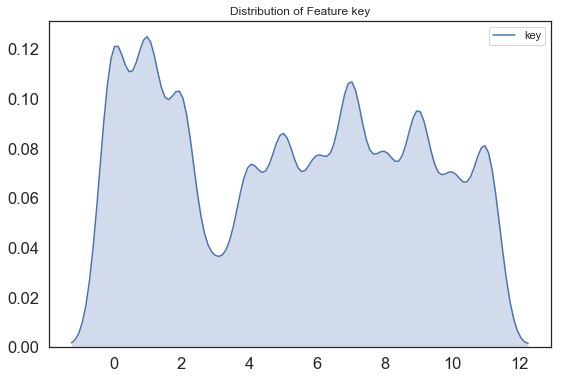


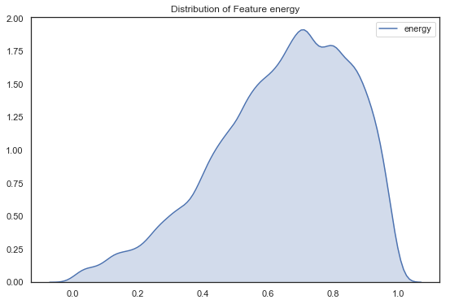


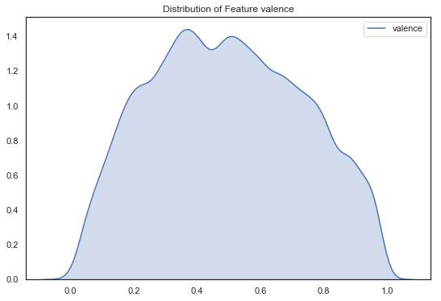


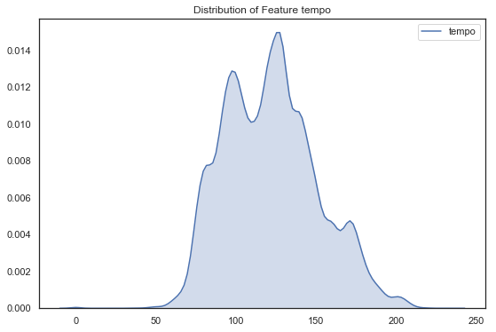


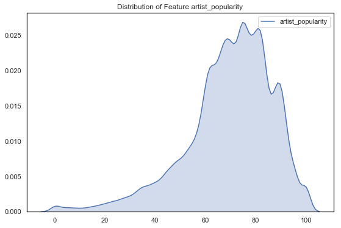


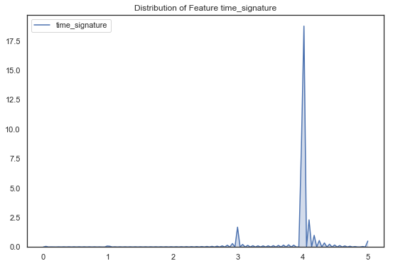


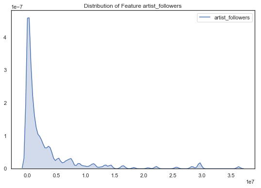


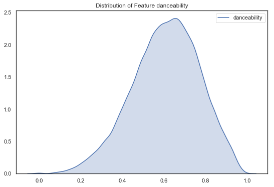


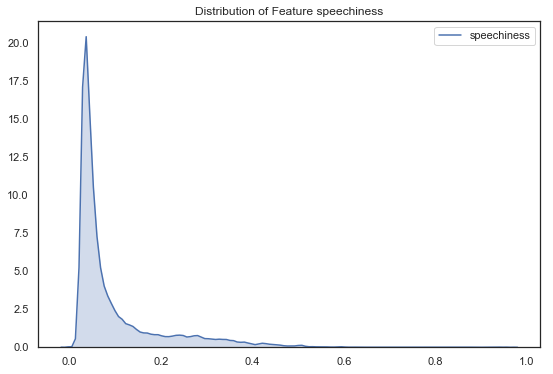


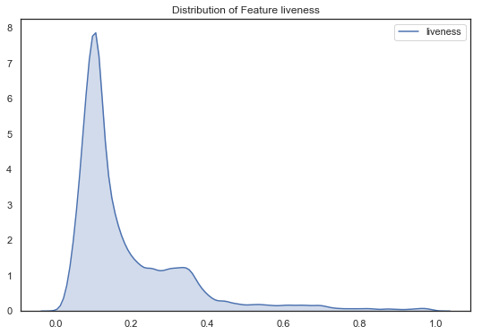


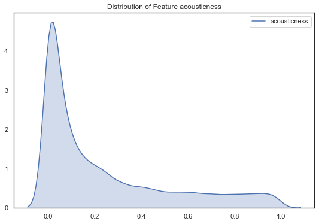


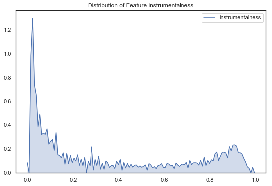


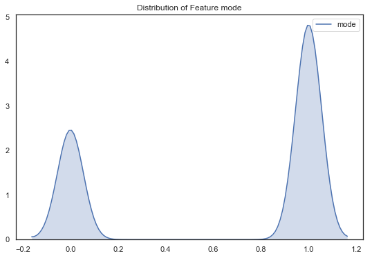


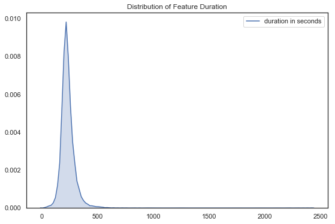


Instrumentalness – this distribution shows that most songs have vocals (close to 0), but there are quite a few songs with no vocals (close to 1).


Song Duration – this was just placed out of curiosity that the vast majority of songs seem to last around 250 seconds (about 4 minutes).


We then decided to group songs by genre and look at the distribution of songs that fall under the five genres we created. The distribution of 1000 songs were as follows:
 
    rap         27.2 %
    pop         22.7 %
    other       21.6 %
    pop rock    14.9 %
    rock        13.6 %

It appears that the most commonly occurring genre is rap, followed by pop.

We then looked at how each feature is distributed when grouped by genre (see appendix 1). A few findings of interest were danceability, energy and artist popularity (shown below). These seem like variables that we could use to discriminate between the genres.


```python
col_names = temp.columns
fig, axs = plt.subplots(14)
fig.set_size_inches(20, 120)
sns.set(style='white', palette='deep',font_scale=1.5)
for i in range(len(col_names_temp)):
    sns.distplot(temp.loc[temp['genre']=='pop'][col_names_temp[i]].values,kde_kws={"label": "pop"},ax = axs[i]).set_title(col_names_temp[i])#,hue=casual_mean_w.iloc[0:,1] ,data=casual_mean_w, style =casual_mean_w.iloc[0:,1] , markers=True, dashes=False,ax=ax1).set_title('how each weather category affects number of casual riders in different hour of a day')
    sns.distplot(temp.loc[temp['genre']=='rock'][col_names_temp[i]].values,kde_kws={"label": "rock"},ax = axs[i]).set_title(col_names_temp[i]) #,hue=casual_mean_w.iloc[0:,1] ,data=casual_mean_w, style =casual_mean_w.iloc[0:,1] , markers=True, dashes=False,ax=ax1).set_title('how each weather category affects number of casual riders in different hour of a day')
    sns.distplot(temp.loc[temp['genre']=='rap'][col_names_temp[i]].values,kde_kws={"label": "rap"},ax = axs[i]).set_title(col_names_temp[i]) #,hue=casual_mean_w.iloc[0:,1] ,data=casual_mean_w, style =casual_mean_w.iloc[0:,1] , markers=True, dashes=False,ax=ax1).set_title('how each weather category affects number of casual riders in different hour of a day')
    sns.distplot(temp.loc[temp['genre']=='pop rock'][col_names_temp[i]].values,kde_kws={"label": "pop rock"},ax = axs[i]).set_title(col_names_temp[i]) #,hue=casual_mean_w.iloc[0:,1] ,data=casual_mean_w, style =casual_mean_w.iloc[0:,1] , markers=True, dashes=False,ax=ax1).set_title('how each weather category affects number of casual riders in different hour of a day')
    sns.distplot(temp.loc[temp['genre']=='other'][col_names_temp[i]].values,kde_kws={"label": "other"},ax = axs[i]).set_title(col_names_temp[i]) #,hue=casual_mean_w.iloc[0:,1] ,data=casual_mean_w, style =casual_mean_w.iloc[0:,1] , markers=True, dashes=False,ax=ax1).set_title('how each weather category affects number of casual riders in different hour of a day')

fig.savefig('feature_hist.png')

```


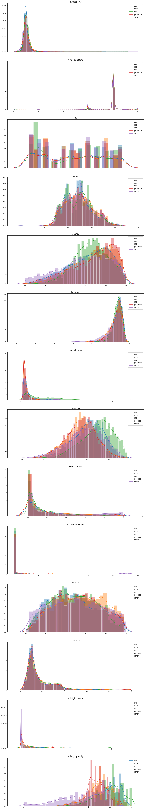


```python
songs_encoded = pd.get_dummies(temp,columns = ['genre'],drop_first=True)
songs_encoded .head()

#### the correlation code would goes after this  @1
```


<div>
<style scoped>
    .dataframe tbody tr th:only-of-type {
        vertical-align: middle;
    }

    .dataframe tbody tr th {
        vertical-align: top;
    }

    .dataframe thead th {
        text-align: right;
    }
</style>
<table border="1" class="dataframe">
  <thead>
    <tr style="text-align: right;">
      <th></th>
      <th>song_uri</th>
      <th>duration_ms</th>
      <th>time_signature</th>
      <th>key</th>
      <th>tempo</th>
      <th>energy</th>
      <th>mode</th>
      <th>loudness</th>
      <th>speechiness</th>
      <th>danceability</th>
      <th>acousticness</th>
      <th>instrumentalness</th>
      <th>valence</th>
      <th>liveness</th>
      <th>artist_followers</th>
      <th>artist_uri</th>
      <th>artist_name</th>
      <th>artist_popularity</th>
      <th>genre_pop</th>
      <th>genre_pop rock</th>
      <th>genre_rap</th>
      <th>genre_rock</th>
    </tr>
  </thead>
  <tbody>
    <tr>
      <th>0</th>
      <td>spotify:track:0UaMYEvWZi0ZqiDOoHU3YI</td>
      <td>226864</td>
      <td>4</td>
      <td>4</td>
      <td>125.461</td>
      <td>0.813</td>
      <td>0</td>
      <td>-7.105</td>
      <td>0.1210</td>
      <td>0.904</td>
      <td>0.03110</td>
      <td>0.006970</td>
      <td>0.810</td>
      <td>0.0471</td>
      <td>900226</td>
      <td>spotify:artist:2wIVse2owClT7go1WT98tk</td>
      <td>Missy Elliott</td>
      <td>76</td>
      <td>0</td>
      <td>0</td>
      <td>1</td>
      <td>0</td>
    </tr>
    <tr>
      <th>1</th>
      <td>spotify:track:6I9VzXrHxO9rA9A5euc8Ak</td>
      <td>198800</td>
      <td>4</td>
      <td>5</td>
      <td>143.040</td>
      <td>0.838</td>
      <td>0</td>
      <td>-3.914</td>
      <td>0.1140</td>
      <td>0.774</td>
      <td>0.02490</td>
      <td>0.025000</td>
      <td>0.924</td>
      <td>0.2420</td>
      <td>5407311</td>
      <td>spotify:artist:26dSoYclwsYLMAKD3tpOr4</td>
      <td>Britney Spears</td>
      <td>81</td>
      <td>1</td>
      <td>0</td>
      <td>0</td>
      <td>0</td>
    </tr>
    <tr>
      <th>2</th>
      <td>spotify:track:0WqIKmW4BTrj3eJFmnCKMv</td>
      <td>235933</td>
      <td>4</td>
      <td>2</td>
      <td>99.259</td>
      <td>0.758</td>
      <td>0</td>
      <td>-6.583</td>
      <td>0.2100</td>
      <td>0.664</td>
      <td>0.00238</td>
      <td>0.000000</td>
      <td>0.701</td>
      <td>0.0598</td>
      <td>16514236</td>
      <td>spotify:artist:6vWDO969PvNqNYHIOW5v0m</td>
      <td>Beyoncé</td>
      <td>87</td>
      <td>1</td>
      <td>0</td>
      <td>0</td>
      <td>0</td>
    </tr>
    <tr>
      <th>3</th>
      <td>spotify:track:1AWQoqb9bSvzTjaLralEkT</td>
      <td>267267</td>
      <td>4</td>
      <td>4</td>
      <td>100.972</td>
      <td>0.714</td>
      <td>0</td>
      <td>-6.055</td>
      <td>0.1400</td>
      <td>0.891</td>
      <td>0.20200</td>
      <td>0.000234</td>
      <td>0.818</td>
      <td>0.0521</td>
      <td>7281071</td>
      <td>spotify:artist:31TPClRtHm23RisEBtV3X7</td>
      <td>Justin Timberlake</td>
      <td>83</td>
      <td>1</td>
      <td>0</td>
      <td>0</td>
      <td>0</td>
    </tr>
    <tr>
      <th>4</th>
      <td>spotify:track:1lzr43nnXAijIGYnCT8M8H</td>
      <td>227600</td>
      <td>4</td>
      <td>0</td>
      <td>94.759</td>
      <td>0.606</td>
      <td>1</td>
      <td>-4.596</td>
      <td>0.0713</td>
      <td>0.853</td>
      <td>0.05610</td>
      <td>0.000000</td>
      <td>0.654</td>
      <td>0.3130</td>
      <td>1036043</td>
      <td>spotify:artist:5EvFsr3kj42KNv97ZEnqij</td>
      <td>Shaggy</td>
      <td>74</td>
      <td>0</td>
      <td>0</td>
      <td>1</td>
      <td>0</td>
    </tr>
  </tbody>
</table>
</div>


The Final step of our EDA consisted into looking at boxplots of each feature grouped by genre. The purpose of this was to also see if some variables stand out as being useful for prediction. The results of this analysis are shown in appendix 3. From this analysis we discovered that a few informative variables are Speechness, Danceability, Log of instrumentalness, Artist followers, and Artist popularity:


```python
for i in range(len(col_names_temp)):
    fig, axs = plt.subplots(1)
    fig.set_size_inches(16, 10)
    sns.set(font_scale=1.5,style='white', palette='deep') 
    axs.set_yscale("log")
    sns.boxplot(x = temp['genre'] , y=temp[col_names_temp[i]].values,palette='pastel').set_title(col_names_temp[i]) 
    fig.savefig('feature_violin_{}.png'.format(i))


```


    /Users/danny_barjum/anaconda3/lib/python3.6/site-packages/matplotlib/axes/_base.py:3443: UserWarning: Attempting to set identical bottom==top results
    in singular transformations; automatically expanding.
    bottom=1.0, top=1.0
      'bottom=%s, top=%s') % (bottom, top))
    /Users/danny_barjum/anaconda3/lib/python3.6/site-packages/matplotlib/ticker.py:2198: UserWarning: Data has no positive values, and therefore cannot be log-scaled.
      "Data has no positive values, and therefore cannot be "
    /Users/danny_barjum/anaconda3/lib/python3.6/site-packages/matplotlib/ticker.py:2198: UserWarning: Data has no positive values, and therefore cannot be log-scaled.
      "Data has no positive values, and therefore cannot be "
    /Users/danny_barjum/anaconda3/lib/python3.6/site-packages/matplotlib/ticker.py:2198: UserWarning: Data has no positive values, and therefore cannot be log-scaled.
      "Data has no positive values, and therefore cannot be "
    /Users/danny_barjum/anaconda3/lib/python3.6/site-packages/matplotlib/ticker.py:2198: UserWarning: Data has no positive values, and therefore cannot be log-scaled.
      "Data has no positive values, and therefore cannot be "
    /Users/danny_barjum/anaconda3/lib/python3.6/site-packages/matplotlib/ticker.py:2198: UserWarning: Data has no positive values, and therefore cannot be log-scaled.
      "Data has no positive values, and therefore cannot be "
    /Users/danny_barjum/anaconda3/lib/python3.6/site-packages/matplotlib/ticker.py:2198: UserWarning: Data has no positive values, and therefore cannot be log-scaled.
      "Data has no positive values, and therefore cannot be "


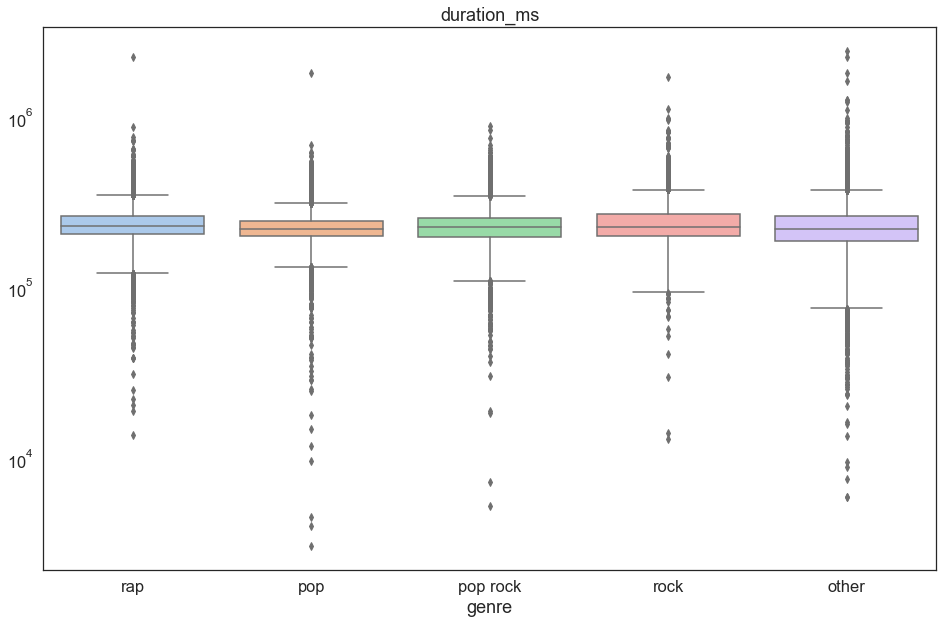


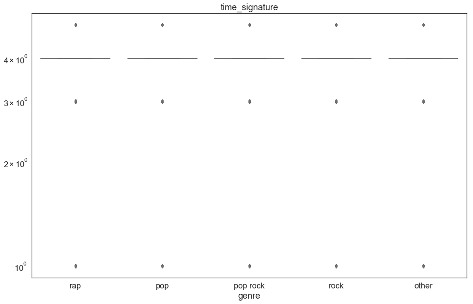


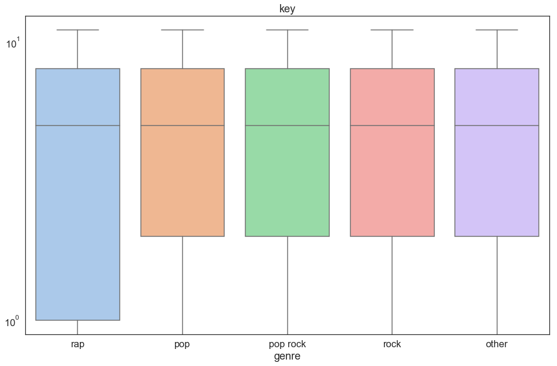


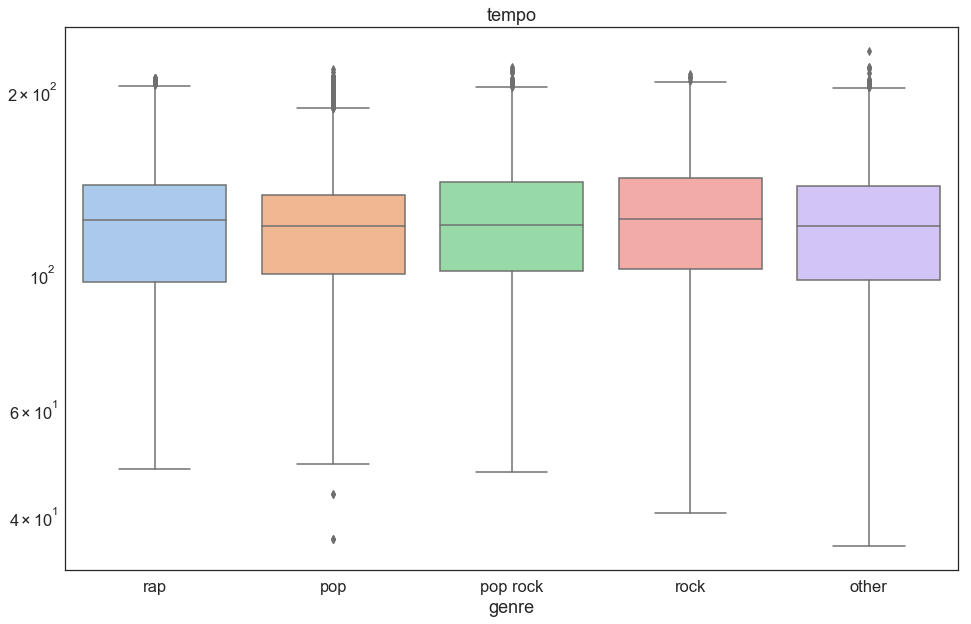


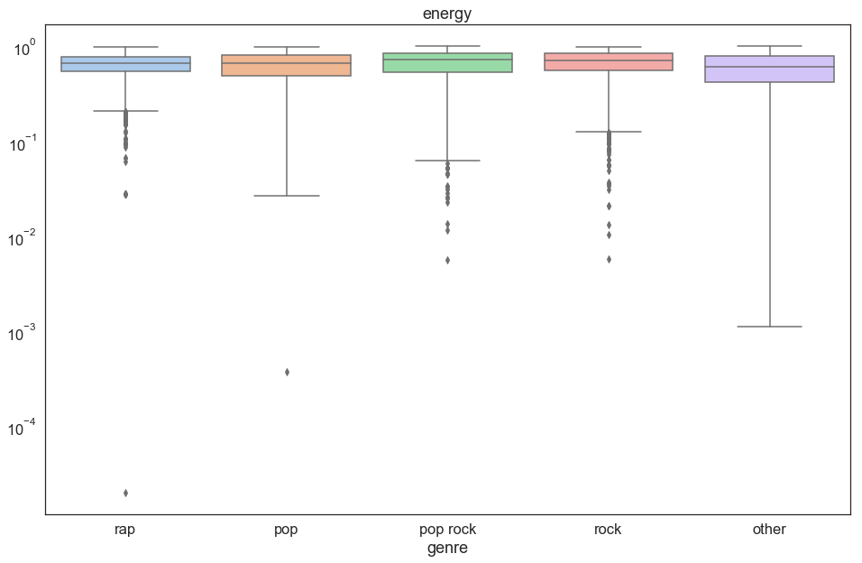


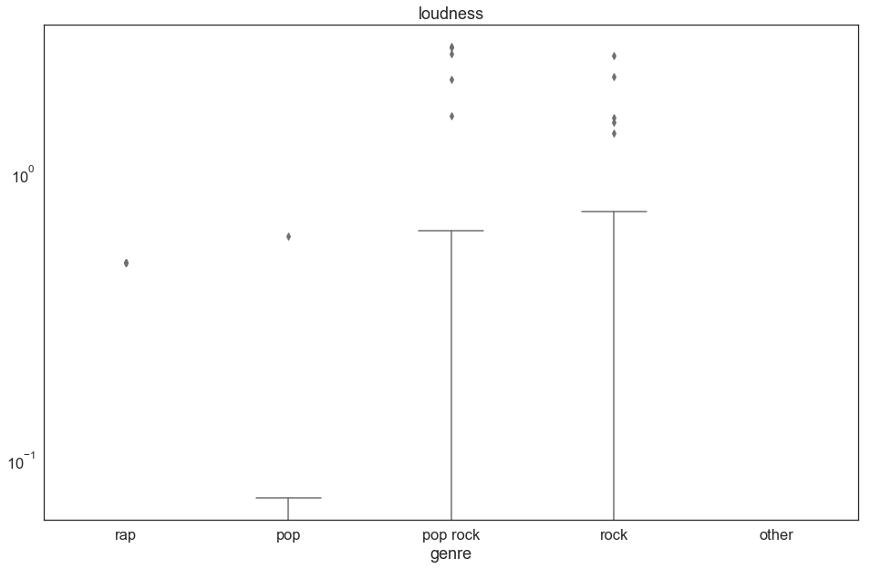


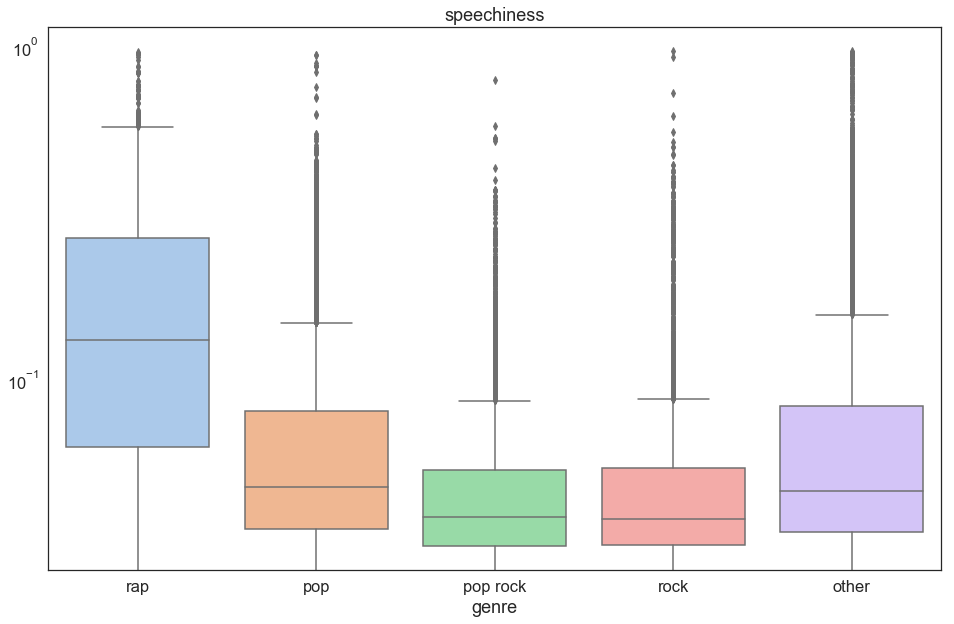


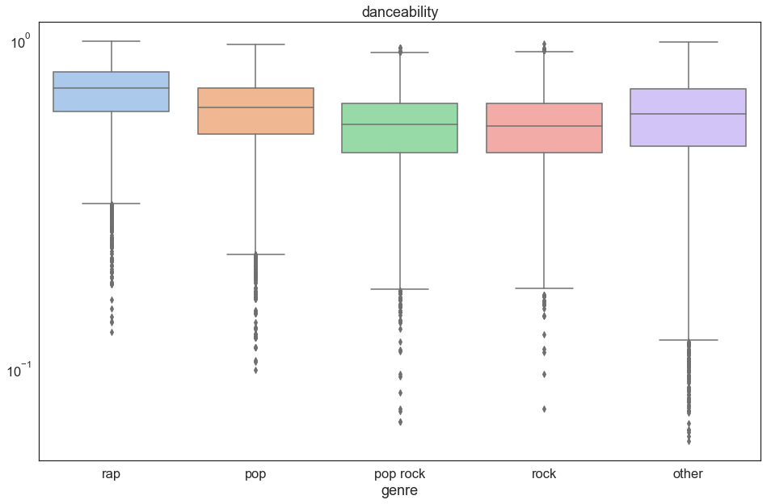


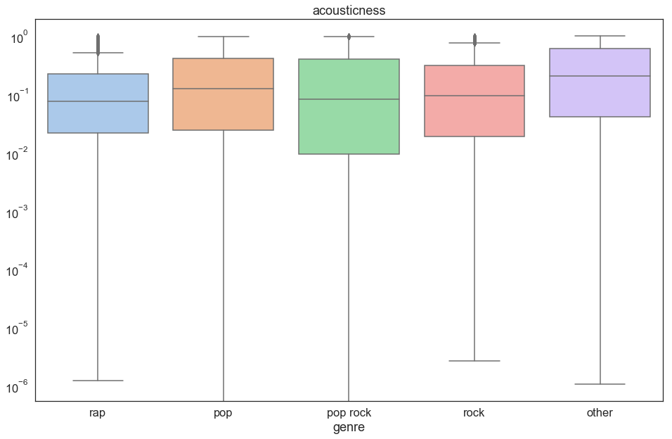


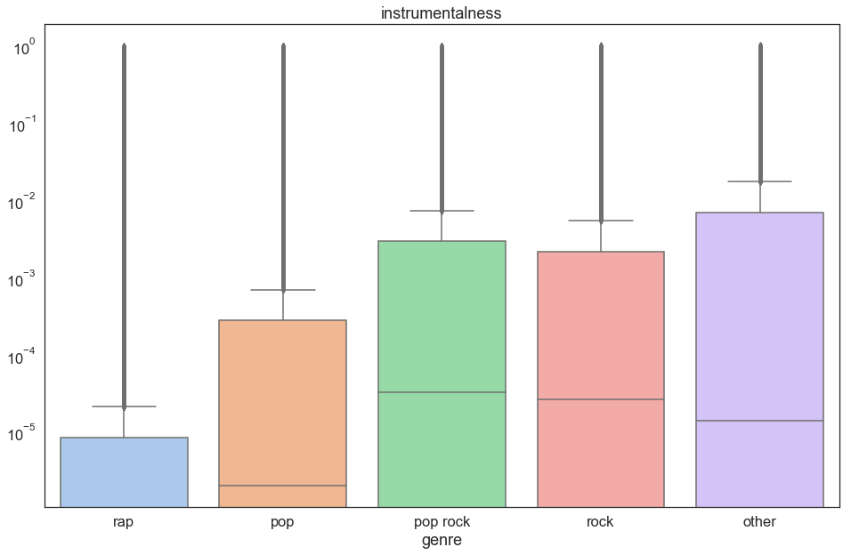


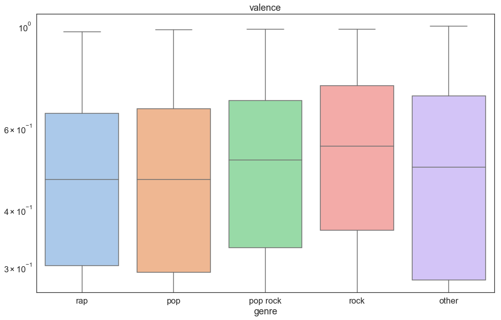


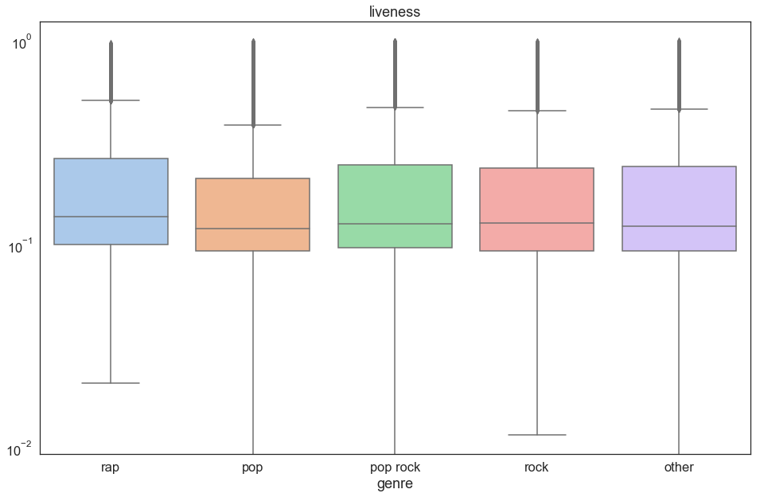


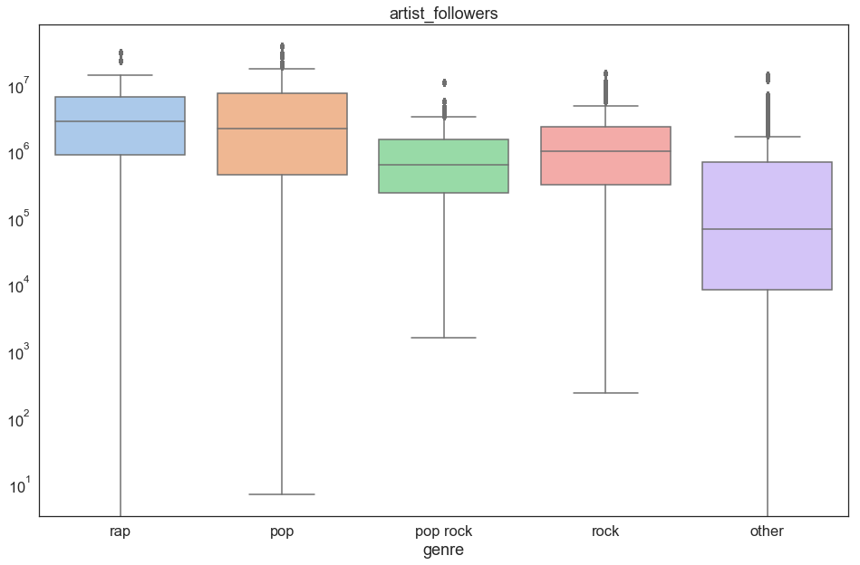


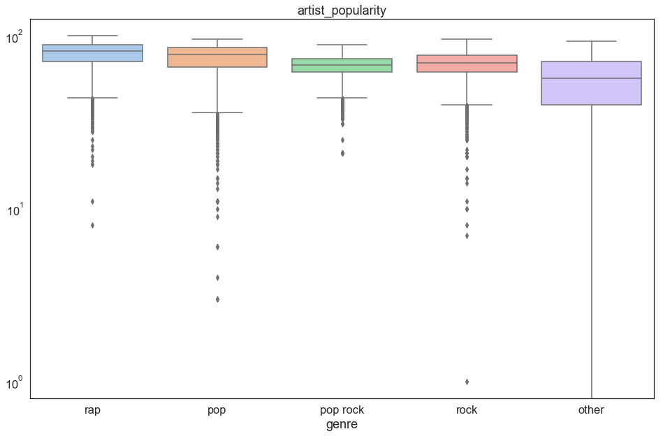


```python

fig, axs = plt.subplots(14)
fig.set_size_inches(20, 120)
sns.set(font_scale=1.5,style='white', palette='deep') 
for i in range(len(col_names_temp)):
    sns.violinplot(x = temp['genre'] , y=temp[col_names_temp[i]].values,ax = axs[i],showfliers=False).set_title(col_names_temp[i])#,hue=casual_mean_w.iloc[0:,1] ,data=casual_mean_w, style =casual_mean_w.iloc[0:,1] , markers=True, dashes=False,ax=ax1).set_title('how each weather category affects number of casual riders in different hour of a day')
fig.savefig('feature_violin.png')


```


```python
fig, axs = plt.subplots(14)
fig.set_size_inches(20, 120)
sns.set(font_scale=1.5,style='white', palette='deep') 
for i in range(len(col_names_temp)):
    sns.boxplot(x = temp['genre'] , y=temp[col_names_temp[i]].values,ax = axs[i],showfliers=0).set_title(col_names_temp[i]) 
fig.savefig('feature_boxplot.png')

### @2
```


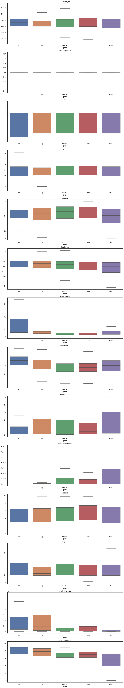

