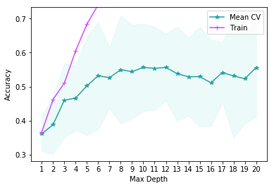
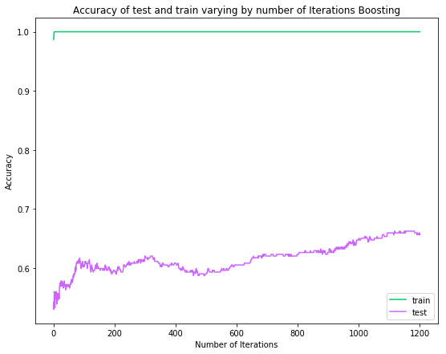
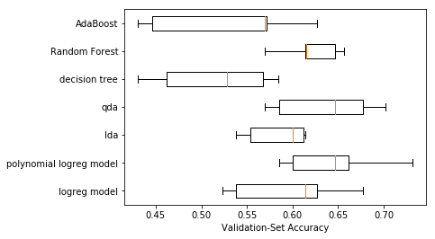

## Contents
{:.no_toc}
*  
{: toc}


<hr style="height:2pt">


```python
import matplotlib as mpl
import matplotlib.cm as cm
import matplotlib.pyplot as plt
%matplotlib inline

import pandas as pd
import numpy as np
import json

from sklearn.model_selection import train_test_split
from sklearn.linear_model import LogisticRegressionCV
from sklearn.model_selection import cross_val_score
from sklearn.preprocessing import PolynomialFeatures
from sklearn.discriminant_analysis import LinearDiscriminantAnalysis
from sklearn.discriminant_analysis import QuadraticDiscriminantAnalysis
from sklearn.ensemble import RandomForestClassifier
from sklearn.ensemble import AdaBoostClassifier

from sklearn.tree import DecisionTreeClassifier

from sklearn.pipeline import make_pipeline
from sklearn.preprocessing import StandardScaler

import recommend_songs_set as recs #function list created for song recommendation
import spotify_api_function_set as sps
```


```python
#reading playlist files which are in json format
path = "data"
df_temp = pd.read_csv(path+"/playlist_df_ballanced.csv")

```


```python
df = pd.DataFrame(df_temp.fillna(0))
```


```python
len(df)
```


    1325


```python
df_model = df.copy()
#df_model = df_model.drop(["pid",'playlist_genre'])
data_train, data_test = train_test_split(df, test_size=.25, random_state=99, stratify = df.playlist_genre);
y_train = data_train['playlist_genre']
x_train = data_train.drop(columns = ['pid','playlist_genre','genre_other','genre_pop','genre_pop rock','genre_rap','genre_rock'])
y_test = data_test['playlist_genre']
x_test_pid = data_test.pid
x_test = data_test.drop(columns = ['pid','playlist_genre','genre_other','genre_pop','genre_pop rock','genre_rap','genre_rock'])
```


```python
cv_scores = pd.DataFrame(np.zeros((5,4)))
cv_scores.columns = ['logreg model','polynomial logreg model','lda','qda']
```


## Model 1: Logistic regression with cross validation

For the base model, we used logistic regression with corss validation. CS is used to reduce the chance of the overfitting to the training set. And we saved the accuarcy result in a cv_scores. 

**Standardization of dataset** 
Due to difference in the scale of the variables, we fitted the model with the standardized data.


```python
logreg_model2 = make_pipeline(
    StandardScaler(),
    LogisticRegressionCV(multi_class="ovr", cv=5)).fit(x_train, y_train)
print("The 5-fold CV score for linear model on test set is:\n"+str(cross_val_score(logreg_model2, x_test, y_test, cv=5))) 
pred_y_test_logreg_model2 = logreg_model2.predict(x_test)
cv_scores['logreg model'] = cross_val_score(logreg_model2, x_test, y_test, cv=5)
```


    The 5-fold CV score for linear model on test set is:
    [0.61428571 0.62686567 0.53846154 0.67692308 0.52307692]


## Model 2 : Polynomial logistic regression with cross validation

For the second model, we added the polynomial degree 2 to the features list, to give more felxibility to the bouandaries of the classification. And in the summary table we campare the performance of the model.


```python
polynomial_logreg_model = make_pipeline(
    PolynomialFeatures(degree=2, include_bias=False),
    StandardScaler(),
    LogisticRegressionCV(multi_class="ovr", cv=5)).fit(x_train, y_train);
print("The 5-fold CV score for polynomial logreg model on test set is:\n" +str(cross_val_score(polynomial_logreg_model, x_test, y_test, cv=5))) 
cv_scores['polynomial logreg model'] = cross_val_score(polynomial_logreg_model, x_test, y_test, cv=5)
```


    The 5-fold CV score for polynomial logreg model on test set is:
    [0.58571429 0.73134328 0.64615385 0.66153846 0.6       ]


---
## Model 3 : LDA


```python
lda = LinearDiscriminantAnalysis().fit(x_train, y_train)
#print("The 5-fold CV score for lda model on test set is:\n" +str(cross_val_score(lda, x_test, y_test, cv=5)), "\n average score is =",np.mean(cross_val_score(lda, x_test, y_test, cv=5)) ) 
cv_scores['lda'] = cross_val_score(lda, x_test, y_test, cv=5)
pred_y_test_lda = lda.predict(x_test)


```


 ## Model 4 : QDA


```python
qda = QuadraticDiscriminantAnalysis().fit(x_train, y_train)
#print("The 5-fold CV score for polynomial logreg model on test set is:\n"+str(cross_val_score(qda, x_test, y_test, cv=5)), "\n average score is =",np.mean(cross_val_score(qda, x_test, y_test, cv=5)) ) 
cv_scores['qda'] = cross_val_score(qda, x_test, y_test, cv=5)
pred_y_test_qda = qda.predict(x_test)


```


---
## Model 5: Simple Decision tree

We used the depths of the tree as a hyperparamether and at the end of checking the performance of trees with different depth, we creatd a decision tree with the best depth 


```python
depths = list(range(1, 21))
train_scores, cvmeans, cvstds = [], [], []
for depth in depths:
    clf = DecisionTreeClassifier(max_depth=depth)
    train_scores.append(clf.fit(x_train, y_train).score(x_train, y_train))
    scores = cross_val_score(estimator=clf, X=x_test, y=y_test, cv=5)
    cvmeans.append(scores.mean())
    cvstds.append(scores.std())

cvmeans = np.array(cvmeans)
cvstds = np.array(cvstds)
```


```python
#Ploting the decsion tree scores
plt.plot(depths, cvmeans, '*-', label="Mean CV", color ="#29a3a3" )
plt.fill_between(depths, cvmeans - 2*cvstds, cvmeans + 2*cvstds, alpha=0.3, color = "#c2f0f0")
ylim = plt.ylim()
plt.plot(depths, train_scores, '-+', label="Train",color = "#d24dff")
plt.ylim(ylim)
plt.legend()
plt.ylabel("Accuracy")
plt.xlabel("Max Depth")
plt.xticks(depths)
plt.show()
```





```python
best_depth = 12
best_decision_tree = DecisionTreeClassifier(max_depth=best_depth, random_state=99).fit(x_train, y_train)
cv_scores['decision tree'] = cross_val_score(best_decision_tree, x_test, y_test, cv=5)
```


---
## Model 6: Random Forest


```python
n_trees = 500
```


```python
#Fit a Random Forest model
fitted_rf = RandomForestClassifier(n_estimators=n_trees, max_depth=best_depth).fit(x_train,y_train)
random_forest_train_score = fitted_rf.score(x_train, y_train)
random_forest_test_score = fitted_rf.score(x_test, y_test)
print(f"The Random Forest scored {random_forest_train_score:.3f} on the training set.")
print(f"The Random Forest scored {random_forest_test_score:.3f} on the test set.")
cv_scores['Random Forest'] = cross_val_score(fitted_rf, x_test, y_test, cv=5)
```


    The Random Forest scored 0.998 on the training set.
    The Random Forest scored 0.693 on the test set.


---
## Model 7 : AdaBoost


```python
ada = AdaBoostClassifier(base_estimator=DecisionTreeClassifier(max_depth=best_depth), n_estimators=1200, learning_rate=0.05)
ada.fit(x_train, y_train)
ada_train_scores = list(ada.staged_score(x_train, y_train))
ada_test_scores = list(ada.staged_score(x_test, y_test))
cv_scores['AdaBoost'] = cross_val_score(ada, x_test, y_test, cv=5)
```


```python
plt.figure(figsize=(9,7))
plt.plot(range(1,1201), ada_train_scores, 'g-', label = 'train', color = "#00cc66")
plt.plot(range(1,1201), ada_test_scores, 'b-', label = 'test',color="#cc66ff")

plt.ylabel("Accuracy")
plt.xlabel("Number of Iterations")
plt.title('Accuracy of test and train varying by number of Iterations Boosting')
plt.legend();
```





----
## Comparing Models

As we saw in the statistic table of the cross validation score of 7 models, the random forest overperforms all others on average, thus we will keep the random forest as our prediction model.


```python
named_classifiers = cv_scores.columns.values
positions = np.arange(len(named_classifiers))
plt.boxplot(cv_scores.T, vert=False, positions=positions);
plt.yticks(positions,named_classifiers )
#plt.ylabel("Classifier")
plt.xlabel("Validation-Set Accuracy");
```





```python
cv_scores.describe()
```


<div>
<style scoped>
    .dataframe tbody tr th:only-of-type {
        vertical-align: middle;
    }

    .dataframe tbody tr th {
        vertical-align: top;
    }

    .dataframe thead th {
        text-align: right;
    }
</style>
<table border="1" class="dataframe">
  <thead>
    <tr style="text-align: right;">
      <th></th>
      <th>logreg model</th>
      <th>polynomial logreg model</th>
      <th>lda</th>
      <th>qda</th>
      <th>decision tree</th>
      <th>Random Forest</th>
      <th>AdaBoost</th>
    </tr>
  </thead>
  <tbody>
    <tr>
      <th>count</th>
      <td>5.000000</td>
      <td>5.000000</td>
      <td>5.000000</td>
      <td>5.000000</td>
      <td>5.000000</td>
      <td>5.000000</td>
      <td>5.000000</td>
    </tr>
    <tr>
      <th>mean</th>
      <td>0.595923</td>
      <td>0.644950</td>
      <td>0.583707</td>
      <td>0.635903</td>
      <td>0.514532</td>
      <td>0.620354</td>
      <td>0.528890</td>
    </tr>
    <tr>
      <th>std</th>
      <td>0.064156</td>
      <td>0.057597</td>
      <td>0.035130</td>
      <td>0.057127</td>
      <td>0.066527</td>
      <td>0.034143</td>
      <td>0.085891</td>
    </tr>
    <tr>
      <th>min</th>
      <td>0.523077</td>
      <td>0.585714</td>
      <td>0.538462</td>
      <td>0.569231</td>
      <td>0.430769</td>
      <td>0.569231</td>
      <td>0.430769</td>
    </tr>
    <tr>
      <th>25%</th>
      <td>0.538462</td>
      <td>0.600000</td>
      <td>0.553846</td>
      <td>0.585714</td>
      <td>0.461538</td>
      <td>0.614286</td>
      <td>0.446154</td>
    </tr>
    <tr>
      <th>50%</th>
      <td>0.614286</td>
      <td>0.646154</td>
      <td>0.600000</td>
      <td>0.646154</td>
      <td>0.528571</td>
      <td>0.615385</td>
      <td>0.569231</td>
    </tr>
    <tr>
      <th>75%</th>
      <td>0.626866</td>
      <td>0.661538</td>
      <td>0.611940</td>
      <td>0.676923</td>
      <td>0.567164</td>
      <td>0.646154</td>
      <td>0.571429</td>
    </tr>
    <tr>
      <th>max</th>
      <td>0.676923</td>
      <td>0.731343</td>
      <td>0.614286</td>
      <td>0.701493</td>
      <td>0.584615</td>
      <td>0.656716</td>
      <td>0.626866</td>
    </tr>
  </tbody>
</table>
</div>


---
** Prediction **


```python
pred_y_test_rf = fitted_rf.predict(x_test)
```


## Recommending Songs
<hr style="height:1pt">

In this section we recommend a set of N songs to be added to a given playlist. Our set of playlists is the test set, therefore, for each playlist in the test set, we recommend N additional and unique songs to be added to each playlist. The recommended songs are obtained from a pool we created that contains approximately 35,000 unique songs.

We choose songs from the pool based on two methods:

The first model is the simpler model where based on the predicted genre of a given playlist, we randomly recommend songs that belong to that genre. We make sure to recommended a set of unique songs that are not present in the playlist. Clearly, this is a very simple model and might not be reflective of the style of songs that are in a given playlist.

We improve upon this simple model in our second model. In this improved model, we not only look at the predicted genre for song selection, but we utilize cosine similarity to rank which songs from the pool most likely resemble a given playlist. For cosine similarity comparison, we use the average of each song feature to create a vector to compare against each song's feature vector in the pool.


```python
#remove string 'genre_' from list of predictions as not needed
y_pred_selected = [g[len('genre_'):] for g in pred_y_test_rf]

#add playlist id to test set to know which songs belong to which playlist
x_test['pid'] = x_test_pid
```


```python
#reading spotify playlist files which are in json format

file_names = ["mpd.slice.0-999", "mpd.slice.1000-1999", "mpd.slice.2000-2999",
              "mpd.slice.3000-3999", "mpd.slice.4000-4999", "mpd.slice.5000-5999",
              "mpd.slice.6000-6999", "mpd.slice.7000-7999", "mpd.slice.8000-8999", "mpd.slice.9000-9999"]

spotify_playlist = []
for file in file_names:
    with open(path+"/"+file+".json", "r") as fd:
        plylist_temp = json.load(fd)
        plylist_temp = plylist_temp.get('playlists')
        spotify_playlist = spotify_playlist + plylist_temp
```


### Simple Model for Song Recommendation

We first define the number of songs we wish to recommend to each playlist in the test sest. In this case, we will recommend 10 additional songs to each playlist and define the path to the pool csv file:


```python
N = 10
pool_path = path+'/'+'song_pool_421000-421999.csv'
```


We then run the simple model. We constructed functions that suggest songs based on genre (the simple model). The function, called "suggest_genre_songs", takes as inputs the number of songs to be recommended, the genre of a given playlist, the list of songs in that playlist, and the path to the pool file. The function returns a dataframe containing an N list of songs to be added to the playlist.

We use a loop to recommend N songs to each of the playlists in the test set. We add a limiter in case we don't want to try recommending songs to all playlists in test set for computational purposes. We store the results in a list.


```python
simple_test_recs = []

stop = 5
i = 0
for pid, current_y in zip(x_test.pid, y_pred_selected):
    current_playlist = sps.get_playlist_n(spotify_playlist[pid], feature = 'track_uri', n_playlist = pid)
    simple_test_recs.append(recs.suggest_genre_songs(N, current_y, current_playlist, pool_path))
    
    i += 1
    if i == stop:
        break
```


### Improved Model for Song Recommendation

The calling and using of the improved model is very similar to the simple model. We call a function that uses the improved model logic to recommend songs based on cosine similarity. The function takes in the same inputs as the simple model with one additional argument which is the feature vector to be used for cosine similarity comparison.


```python
best_test_recs = []

stop = 5
i = 0
for pid, current_y, f_vector in zip(x_test.pid, y_pred_selected, x_test.iterrows()):
    current_playlist = sps.get_playlist_n(spotify_playlist[pid], feature = 'track_uri', n_playlist = pid)
    best_test_recs.append(recs.suggest_best_songs(f_vector[1].drop('pid'), N, current_y, current_playlist, pool_path))
    
    i += 1
    if i == stop:
        break
```


```python
y_pred_selected[4]
```


    'pop rock'


```python
simple_test_recs[4]
```


<div>
<style scoped>
    .dataframe tbody tr th:only-of-type {
        vertical-align: middle;
    }

    .dataframe tbody tr th {
        vertical-align: top;
    }

    .dataframe thead th {
        text-align: right;
    }
</style>
<table border="1" class="dataframe">
  <thead>
    <tr style="text-align: right;">
      <th></th>
      <th>song_name</th>
      <th>artist_name</th>
      <th>album_name</th>
      <th>song_uri</th>
    </tr>
  </thead>
  <tbody>
    <tr>
      <th>0</th>
      <td>Sick of Losing Soulmates</td>
      <td>dodie</td>
      <td>Sick of Losing Soulmates</td>
      <td>spotify:track:4hjbxjZpJ8H6qRCzDOGI0M</td>
    </tr>
    <tr>
      <th>1</th>
      <td>Upside Down &amp; Inside Out</td>
      <td>OK Go</td>
      <td>Hungry Ghost</td>
      <td>spotify:track:4QkYn1SDHFZWbf0tqNCXH5</td>
    </tr>
    <tr>
      <th>2</th>
      <td>If I Were In Your Shoes</td>
      <td>You Me At Six</td>
      <td>Take Off Your Colours</td>
      <td>spotify:track:3ksHcN1MdKel3q3gvWn0ej</td>
    </tr>
    <tr>
      <th>3</th>
      <td>Walk On Water Or Drown</td>
      <td>Mayday Parade</td>
      <td>A Lesson In Romantics</td>
      <td>spotify:track:7k1nk4lxKSVhXs5WgZWXEz</td>
    </tr>
    <tr>
      <th>4</th>
      <td>Obstacle 1</td>
      <td>Interpol</td>
      <td>Turn On The Bright Lights: The Tenth Anniversa...</td>
      <td>spotify:track:7wvtiQ3o8ELEmk2NjSSPpX</td>
    </tr>
    <tr>
      <th>5</th>
      <td>I'm Not Your Hero</td>
      <td>Tegan and Sara</td>
      <td>In Your Head: An Introduction to Tegan And Sara</td>
      <td>spotify:track:4ycwZlffnXdXFwKwj5xcrA</td>
    </tr>
    <tr>
      <th>6</th>
      <td>Ingrid (Bonus Track)</td>
      <td>Local Natives</td>
      <td>Hummingbird</td>
      <td>spotify:track:2Kc4eiF930BJ5nwoOewhAd</td>
    </tr>
    <tr>
      <th>7</th>
      <td>Red Clay Halo</td>
      <td>Gillian Welch</td>
      <td>Time (The Relevator)</td>
      <td>spotify:track:35Zn1EWC4Qj96rkE16JuY2</td>
    </tr>
    <tr>
      <th>8</th>
      <td>Baila Mi Corazón</td>
      <td>Belanova</td>
      <td>Fantasía Pop</td>
      <td>spotify:track:0GB4zJkbXdXBbdJPgudwDx</td>
    </tr>
    <tr>
      <th>9</th>
      <td>Talking In Your Sleep</td>
      <td>The Romantics</td>
      <td>In Heat</td>
      <td>spotify:track:7fRvtXvJMpGfTLdF0M09a1</td>
    </tr>
  </tbody>
</table>
</div>


```python
best_test_recs[4]
```


<div>
<style scoped>
    .dataframe tbody tr th:only-of-type {
        vertical-align: middle;
    }

    .dataframe tbody tr th {
        vertical-align: top;
    }

    .dataframe thead th {
        text-align: right;
    }
</style>
<table border="1" class="dataframe">
  <thead>
    <tr style="text-align: right;">
      <th></th>
      <th>song_name</th>
      <th>artist_name</th>
      <th>album_name</th>
      <th>song_uri</th>
    </tr>
  </thead>
  <tbody>
    <tr>
      <th>0</th>
      <td>El Sol No Regresa</td>
      <td>La Quinta Estacion</td>
      <td>Flores De Alquiler</td>
      <td>spotify:track:2awKQgW88iq9jFM54VaCAp</td>
    </tr>
    <tr>
      <th>1</th>
      <td>Fighting</td>
      <td>Yellowcard</td>
      <td>Paper Walls</td>
      <td>spotify:track:1y8fcrAzJpSsjTgMQPT0ia</td>
    </tr>
    <tr>
      <th>2</th>
      <td>Even Robots Need Blankets</td>
      <td>Mayday Parade</td>
      <td>Monsters In The Closet</td>
      <td>spotify:track:1NivdSEUqwvnC6MzO8VZiG</td>
    </tr>
    <tr>
      <th>3</th>
      <td>Eden</td>
      <td>Sara Bareilles</td>
      <td>The Blessed Unrest</td>
      <td>spotify:track:0oihjTriCn7793AJwKBTrJ</td>
    </tr>
    <tr>
      <th>4</th>
      <td>Lo noto</td>
      <td>Hombres G</td>
      <td>30 años y un día</td>
      <td>spotify:track:3q6Ta92jThS5sOK8r2YSBD</td>
    </tr>
    <tr>
      <th>5</th>
      <td>Name For You</td>
      <td>The Shins</td>
      <td>Heartworms</td>
      <td>spotify:track:6qnaCx4wQQBqFd9XdQyWjC</td>
    </tr>
    <tr>
      <th>6</th>
      <td>Blue Spotted Tail</td>
      <td>Fleet Foxes</td>
      <td>Helplessness Blues</td>
      <td>spotify:track:6ZbdcZO79W18dTwXf356Gp</td>
    </tr>
    <tr>
      <th>7</th>
      <td>Love Like a Sunset Part I</td>
      <td>Phoenix</td>
      <td>Wolfgang Amadeus Phoenix</td>
      <td>spotify:track:6Kh1uaN6zhSyfLb6HaYGqC</td>
    </tr>
    <tr>
      <th>8</th>
      <td>Grey</td>
      <td>Yellowcard</td>
      <td>Lights And Sounds</td>
      <td>spotify:track:49gtJtS8u0GUetaogTL9bm</td>
    </tr>
    <tr>
      <th>9</th>
      <td>Creep</td>
      <td>Stone Temple Pilots</td>
      <td>Core</td>
      <td>spotify:track:0elH6ukMGLyCHJavHutEza</td>
    </tr>
  </tbody>
</table>
</div>


```python
songs = sps.get_playlist_n(spotify_playlist[4], feature = 'track_uri', n_playlist = 4)
```


```python
sp = sps.create_spotipy_obj()
tracks =  sp.tracks(songs)

df_data = []
for i in tracks['tracks']:
    song_name = i['name']
    artist_name = i['artists'][0]['name']
    album_name = i['album']['name']
    song_uri = i['uri']
    df_data.append([song_name, artist_name, album_name, song_uri])

df = pd.DataFrame(df_data)
df.columns = ['song_name', 'artist_name', 'album_name', 'song_uri']
df
```


<div>
<style scoped>
    .dataframe tbody tr th:only-of-type {
        vertical-align: middle;
    }

    .dataframe tbody tr th {
        vertical-align: top;
    }

    .dataframe thead th {
        text-align: right;
    }
</style>
<table border="1" class="dataframe">
  <thead>
    <tr style="text-align: right;">
      <th></th>
      <th>song_name</th>
      <th>artist_name</th>
      <th>album_name</th>
      <th>song_uri</th>
    </tr>
  </thead>
  <tbody>
    <tr>
      <th>0</th>
      <td>Tonight, Tonight - Remastered 2012</td>
      <td>The Smashing Pumpkins</td>
      <td>Mellon Collie And The Infinite Sadness (Remast...</td>
      <td>spotify:track:4iCGSi1RonREsPtfEKYj5b</td>
    </tr>
    <tr>
      <th>1</th>
      <td>Wonderwall - Remastered</td>
      <td>Oasis</td>
      <td>(What's The Story) Morning Glory? [Remastered]</td>
      <td>spotify:track:5qqabIl2vWzo9ApSC317sa</td>
    </tr>
    <tr>
      <th>2</th>
      <td>I Don't Want to Miss a Thing - From the Touchs...</td>
      <td>Aerosmith</td>
      <td>I Don't Want To Miss A Thing</td>
      <td>spotify:track:0c1gHntWjKD7QShC8s99sq</td>
    </tr>
    <tr>
      <th>3</th>
      <td>Jealousy - Remastered Single Version</td>
      <td>Natalie Merchant</td>
      <td>Retrospective 1990-2005 [Ltd. Deluxe Version]</td>
      <td>spotify:track:7p2aGxnxFYf6VLQPEYirPO</td>
    </tr>
    <tr>
      <th>4</th>
      <td>Waterfalls</td>
      <td>TLC</td>
      <td>Crazysexycool</td>
      <td>spotify:track:6qspW4YKycviDFjHBOaqUY</td>
    </tr>
    <tr>
      <th>5</th>
      <td>1979 - Remastered 2012</td>
      <td>The Smashing Pumpkins</td>
      <td>Mellon Collie And The Infinite Sadness (Remast...</td>
      <td>spotify:track:3Y8Ff1nH44jFywAtpgmleZ</td>
    </tr>
    <tr>
      <th>6</th>
      <td>Torn</td>
      <td>Natalie Imbruglia</td>
      <td>Left Of The Middle</td>
      <td>spotify:track:1Jaah2tmN9Hv81A87KZ1MU</td>
    </tr>
    <tr>
      <th>7</th>
      <td>Stay</td>
      <td>Lisa Loeb &amp; Nine Stories</td>
      <td>Tails</td>
      <td>spotify:track:4ARhdB2FzpXcko8T03YVen</td>
    </tr>
    <tr>
      <th>8</th>
      <td>Breathe Again</td>
      <td>Toni Braxton</td>
      <td>Toni Braxton</td>
      <td>spotify:track:68ZD7M5tOBBM0N5XWRECoD</td>
    </tr>
    <tr>
      <th>9</th>
      <td>Angel</td>
      <td>Sarah McLachlan</td>
      <td>Surfacing</td>
      <td>spotify:track:6G8fblD9DbcEmaKOKDy3XL</td>
    </tr>
    <tr>
      <th>10</th>
      <td>Bitter Sweet Symphony</td>
      <td>The Verve</td>
      <td>Urban Hymns (Deluxe / Remastered 2016)</td>
      <td>spotify:track:3Z9PJ6xiEGmcqo2hESEB5n</td>
    </tr>
    <tr>
      <th>11</th>
      <td>Runaway Train</td>
      <td>Soul Asylum</td>
      <td>Grave Dancers Union</td>
      <td>spotify:track:3TW48DvQ7ChwY1Yy1tkMaP</td>
    </tr>
    <tr>
      <th>12</th>
      <td>The Freshmen</td>
      <td>The Verve Pipe</td>
      <td>Villains</td>
      <td>spotify:track:3rfDfPjgHDQ1BUaSHr9xoI</td>
    </tr>
    <tr>
      <th>13</th>
      <td>White Flag</td>
      <td>Dido</td>
      <td>Life For Rent</td>
      <td>spotify:track:6si71supnBUhddjR2FJc2L</td>
    </tr>
    <tr>
      <th>14</th>
      <td>Smooth Operator - Single Version</td>
      <td>Sade</td>
      <td>The Best Of Sade</td>
      <td>spotify:track:3XEtw7t4V5sfd2vtkp0ql7</td>
    </tr>
    <tr>
      <th>15</th>
      <td>Tom's Diner - 7" Version</td>
      <td>DNA</td>
      <td>The Best Of Suzanne Vega - Tried And True</td>
      <td>spotify:track:6HS5QOvhd4w3XqJMDaEWcv</td>
    </tr>
    <tr>
      <th>16</th>
      <td>Only Wanna Be with You</td>
      <td>Hootie &amp; The Blowfish</td>
      <td>Cracked Rear View</td>
      <td>spotify:track:1OFKUn2VLafrHj7ybnap0Q</td>
    </tr>
  </tbody>
</table>
</div>


